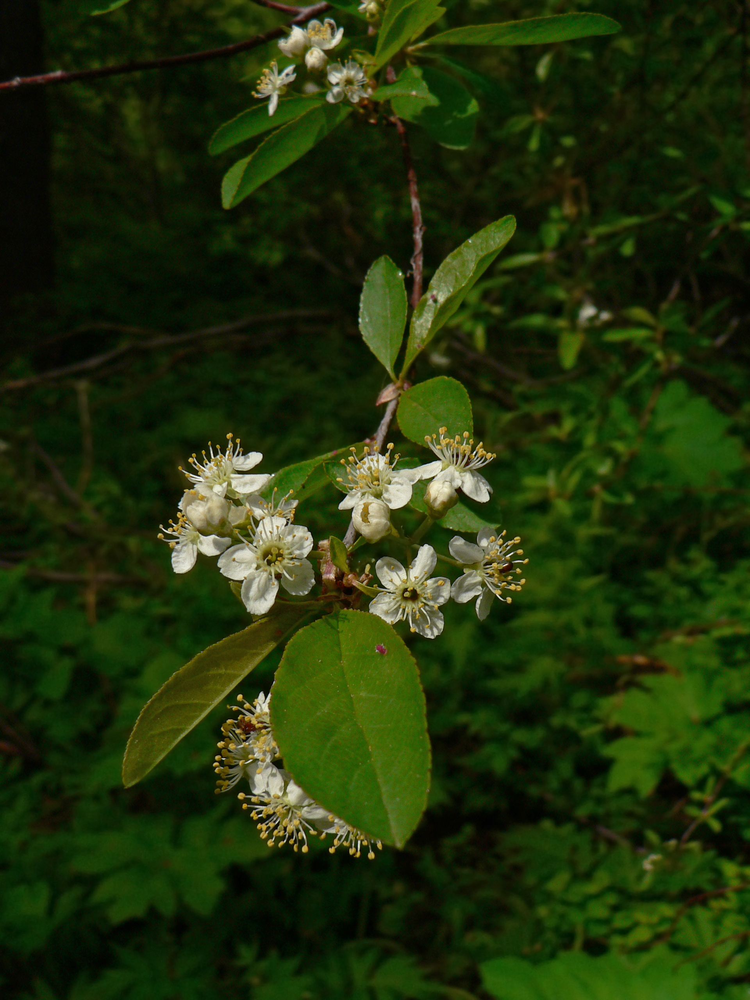

# Bitter Cherry

*Photo: [Author Name](wikimedia-source-url) | License*

## Basic information
- **Scientific name:** Prunus emarginata
- **Plant type:** Deciduous shrub or small tree
- **USDA zones:** 
- **Native region:** Western North America, British Columbia to southern California, east to the Rockies; both sides of the Cascades

## Growth characteristics
- **Mature height:** To ~45 feet (often a small tree, 20–45 ft)
- **Mature spread:** ~15–25 feet
- **Growth rate:** 
- **Lifespan:** 
- **Roots:** 

## Growing conditions
- **Sun requirements:** Full Sun/Part Shade
- **Water needs:** Low-Medium (moist forests and streamsides to open, drier sites; little supplemental water once established)
- **Soil type:** Well-drained loam or sandy loam preferred; tolerates clay
- **Soil pH:** ~5.5–7.5
- **Native habitat:** Moist forests, streamsides, and open areas

## Seasonal interest
- **Bloom time:** 
- **Bloom color:** 
- **Fall color:** 
- **Winter interest:** 

## Wildlife value
- **Attracts:** 
- **Host plant for:** 
- **Provides:** 

## Planting details
- **Quantity needed:** 
- **Location/bed:** 
- **Spacing:** 
- **Companion plants:** 

## Sourcing
- **Purchase source:** 
- **Cost per plant:** 
- **Date purchased:** 
- **Date planted:** 

## Care & maintenance
- **Pruning needs:** 
- **Fertilizer:** 
- **Mulch:** 
- **Special care:** 

## Notes
- **Design notes:** 
- **Observations:** 
- **Challenges:** 

## Sources
- Fourth Corner Nurseries Wholesale Catalog (Fall 2025/Spring 2026): http://fourthcornernurseries.com
- Oregon State University Landscape Plants: https://landscapeplants.oregonstate.edu/plants/prunus-emarginata
- Washington Native Plant Society: https://www.wnps.org/native-plant-directory/207-prunus-emarginata
