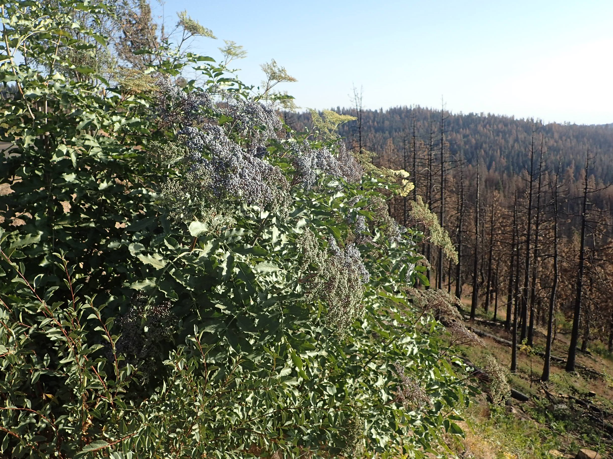

# Blue Elderberry

*Photo: [Krzysztof Ziarnek, Kenraiz](https://commons.wikimedia.org/wiki/File:Sambucus_cerulea_kz15.jpg) | CC BY-SA 4.0*

## Basic information
- **Scientific name:** Sambucus cerulea (syn. Sambucus nigra ssp. cerulea)
- **Plant type:** Deciduous Shrub/Small Tree
- **USDA zones:** 4-9
- **Native region:** Western North America; British Columbia to California, east to Montana

## Growth characteristics
- **Mature height:** 10-20 feet
- **Mature spread:** 8-15 feet
- **Growth rate:** Fast
- **Lifespan:** Long-lived (30+ years)
- **Roots:**

## Growing conditions
- **Sun requirements:** Full Sun/Part Shade
- **Water needs:** Low-Medium (drought tolerant once established)
- **Soil type:** Adaptable; tolerates various soil types
- **Soil pH:** 5.5-7.5
- **Native habitat:** Open forests, woodland edges, streambanks, disturbed areas, drier sites than red elderberry

## Seasonal interest
- **Bloom time:** May-July
- **Bloom color:** Creamy white, flat-topped clusters
- **Fall color:** Yellow
- **Winter interest:** Attractive bark and branching structure

## Wildlife value
- **Attracts:** Birds, butterflies, native bees
- **Host plant for:** Various moth species including the elderberry longhorn beetle
- **Provides:** Highly valuable berries for birds and mammals; nectar; cover and nesting

## Planting details
- **Quantity needed:**
- **Location/bed:**
- **Spacing:** 10-12 feet apart
- **Companion plants:** Oregon grape, serviceberry, snowberry, native grasses

## Sourcing
- **Purchase source:**
- **Cost per plant:**
- **Date purchased:**
- **Date planted:**

## Care & maintenance
- **Pruning needs:** Prune to shape in late winter; can be trained as small tree or multi-stemmed shrub
- **Fertilizer:** Generally not needed
- **Mulch:** 2-3 inches organic mulch
- **Special care:** Very adaptable and low maintenance; more drought tolerant than red elderberry

## Notes
- **Design notes:** Excellent for edible landscaping; berries make delicious jam, syrup, and wine; larger and more sun-tolerant than red elderberry
- **Observations:**
- **Challenges:** Can be aggressive in ideal conditions; berries should be cooked before eating

## Sources
- USDA Plants Database: https://plants.usda.gov/home/plantProfile?symbol=SANI4
- Lady Bird Johnson Wildflower Center: https://www.wildflower.org/plants/result.php?id_plant=sanic5
- Calscape: https://calscape.org/Sambucus-nigra-ssp.-caerulea-(Blue-Elderberry)
