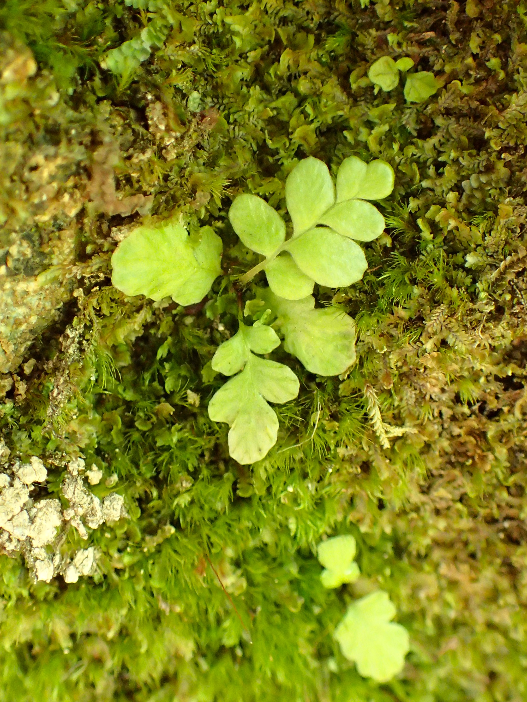

# Deer Fern

*Photo: [Krzysztof Ziarnek, Kenraiz](https://commons.wikimedia.org/wiki/File:Blechnum_spicant_kz04.jpg) | CC BY-SA 4.0*

## Basic information
- **Scientific name:** Blechnum spicant
- **Plant type:** Fern
- **USDA zones:** 5-8
- **Native region:** Pacific Northwest, Western Europe

## Growth characteristics
- **Mature height:** 1-3 ft
- **Mature spread:** 1-2 ft
- **Growth rate:** Slow to Medium
- **Lifespan:** Long-lived perennial
- **Roots:** Fibrous, rhizomatous

## Growing conditions
- **Sun requirements:** Part Shade/Full Shade
- **Water needs:** Medium to High
- **Soil type:** Moist, acidic, humus-rich
- **Soil pH:** 4.5-6.0
- **Native habitat:** Moist coniferous forests, streambanks

## Seasonal interest
- **Bloom time:** N/A (fern)
- **Bloom color:** N/A
- **Fall color:** Evergreen
- **Winter interest:** Evergreen fronds

## Wildlife value
- **Attracts:** Provides cover for small wildlife
- **Host plant for:**
- **Provides:** Shelter, browse for deer

## Planting details
- **Quantity needed:**
- **Location/bed:**
- **Spacing:** 1-2 ft
- **Companion plants:** Sword fern, wild ginger, piggyback plant

## Sourcing
- **Purchase source:**
- **Cost per plant:**
- **Date purchased:**
- **Date planted:**

## Care & maintenance
- **Pruning needs:** Remove dead fronds in spring
- **Fertilizer:** Generally not needed
- **Mulch:** Leaf mold
- **Special care:** Keep consistently moist

## Notes
- **Design notes:**
- **Observations:**
- **Challenges:**
