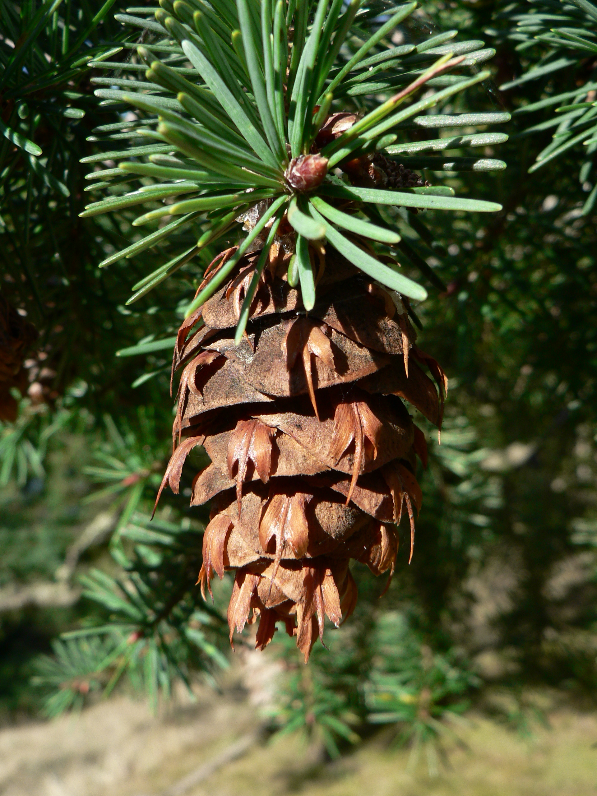

# Douglas Fir

*Photo: [Walter Siegmund](https://commons.wikimedia.org/wiki/File:Pseudotsuga_menziesii_28226.JPG) | CC BY 2.5*

## Basic information
- **Scientific name:** Pseudotsuga menziesii
- **Plant type:** Evergreen Conifer Tree
- **USDA zones:** 4-6
- **Native region:** Pacific Northwest, from British Columbia south through the Cascades and Coast Ranges to central California

## Growth characteristics
- **Mature height:** 70-250 feet (often 40-60 feet in garden settings)
- **Mature spread:** 12-25 feet
- **Growth rate:** Medium to Fast
- **Lifespan:** Very long-lived (500-1,000+ years)
- **Roots:** Deep taproot with wide-spreading lateral roots

## Growing conditions
- **Sun requirements:** Full Sun/Part Sun
- **Water needs:** Low-Medium (drought tolerant once established)
- **Soil type:** Adaptable; prefers deep, moist, well-drained
- **Soil pH:** 5.0-6.0
- **Native habitat:** Moist forests, mountain slopes, valleys at low to mid elevations

## Seasonal interest
- **Bloom time:** April-May (male and female cones)
- **Bloom color:** Reddish-brown (female cones), yellow-orange (male pollen cones)
- **Fall color:** Evergreen
- **Winter interest:** Evergreen form; distinctive pendulous cones with three-pointed bracts

## Wildlife value
- **Attracts:** Birds, squirrels, small mammals
- **Host plant for:** Douglas-fir tussock moth, various bark beetles, pine white butterfly
- **Provides:** Seeds for birds and squirrels; nesting habitat; cover and shelter year-round

## Planting details
- **Quantity needed:**
- **Location/bed:**
- **Spacing:** 15-20 feet apart minimum
- **Companion plants:** Sword fern, salal, Oregon grape, vine maple, red huckleberry

## Sourcing
- **Purchase source:**
- **Cost per plant:**
- **Date purchased:**
- **Date planted:**

## Care & maintenance
- **Pruning needs:** Minimal; remove dead or damaged branches
- **Fertilizer:** Generally not needed in native soils
- **Mulch:** 2-4 inches of organic mulch around base
- **Special care:** Protect young trees from drought stress in first few years; provide adequate space for mature size

## Notes
- **Design notes:** Iconic Pacific Northwest tree; provides tall evergreen canopy and vertical structure; best suited for larger properties due to eventual size
- **Observations:**
- **Challenges:** Can grow very large — consider mature size carefully; susceptible to Swiss needle cast in some coastal areas

## Sources
- Oregon State University Landscape Plants: https://landscapeplants.oregonstate.edu/plants/pseudotsuga-menziesii
- USDA Plants Database: https://plants.usda.gov/home/plantProfile?symbol=PSME
- Missouri Botanical Garden: https://www.missouribotanicalgarden.org/PlantFinder/PlantFinderDetails.aspx?taxonid=277655
