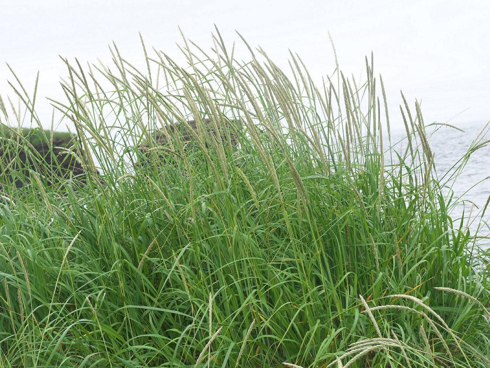

# Dune Grass

*Photo: [Author Name](wikimedia-source-url) | License*

## Basic information
- **Scientific name:** Leymus mollis (American Dunegrass)
- **Plant type:** Perennial grass (Poaceae)
- **USDA zones:** 
- **Native region:** Coastal Alaska across Canada, south from coastal Washington to the central California coast; also Great Lakes and New England

## Growth characteristics
- **Mature height:** 3–5 feet
- **Mature spread:** Clump-forming with strong, spreading rhizomes; can spread aggressively
- **Growth rate:** Fast (rhizomatous)
- **Lifespan:** 
- **Roots:** Strong, deep rhizomes (stabilizes sand)

## Growing conditions
- **Sun requirements:** Full Sun
- **Water needs:** Low (drought tolerant once established; salt-spray tolerant)
- **Soil type:** Sandy, well-drained soils; avoid heavy clay and rich/wet beds (prone to root rot)
- **Soil pH:** 
- **Native habitat:** Coastal sand dunes and beaches; freshwater beaches

## Seasonal interest
- **Bloom time:** 
- **Bloom color:** 
- **Fall color:** 
- **Winter interest:** 

## Wildlife value
- **Attracts:** 
- **Host plant for:** 
- **Provides:** 

## Planting details
- **Quantity needed:** 
- **Location/bed:** 
- **Spacing:** 
- **Companion plants:** 

## Sourcing
- **Purchase source:** 
- **Cost per plant:** 
- **Date purchased:** 
- **Date planted:** 

## Care & maintenance
- **Pruning needs:** 
- **Fertilizer:** 
- **Mulch:** 
- **Special care:** 

## Notes
- **Design notes:** 
- **Observations:** 
- **Challenges:** 

## Sources
- Fourth Corner Nurseries Wholesale Catalog (Fall 2025/Spring 2026): http://fourthcornernurseries.com
- Lady Bird Johnson Wildflower Center: https://www.wildflower.org/plants/result.php?id_plant=lemo8
- Calscape (California Native Plant Society): https://calscape.org/Elymus-mollis-(American-Dunegrass)
