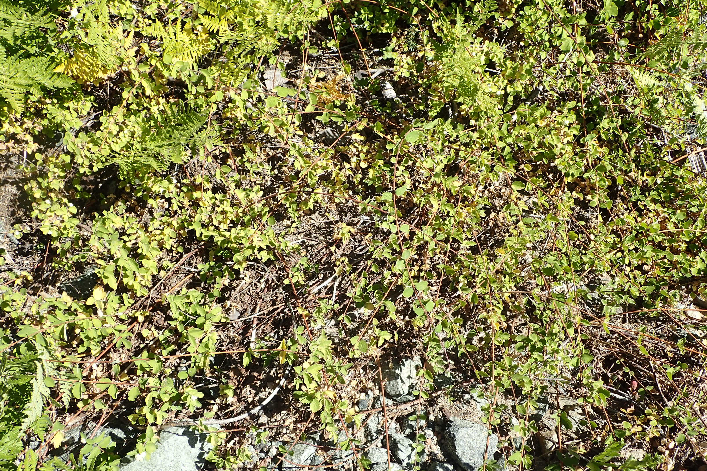

# Dwarf Snowberry

*Photo: [Krzysztof Ziarnek, Kenraiz](https://commons.wikimedia.org/wiki/File:Symphoricarpos_mollis_kz04.jpg) | CC BY-SA 4.0*

## Basic information
- **Scientific name:** Symphoricarpos mollis (syn. S. albus var. mollis)
- **Plant type:** Deciduous Shrub/Groundcover
- **USDA zones:** 5-9
- **Native region:** Pacific Northwest, from British Columbia to California

## Growth characteristics
- **Mature height:** 1-3 feet
- **Mature spread:** 3-6 feet (spreads by suckers)
- **Growth rate:** Medium
- **Lifespan:** Long-lived shrub
- **Roots:**

## Growing conditions
- **Sun requirements:** Full Sun/Part Shade/Full Shade (tolerates wide range)
- **Water needs:** Low-Medium (drought tolerant once established)
- **Soil type:** Adaptable; tolerates poor, dry soils
- **Soil pH:** 5.5-7.5
- **Native habitat:**

## Seasonal interest
- **Bloom time:** May-July
- **Bloom color:** Pink to white, small bell-shaped
- **Fall color:** Yellow-green
- **Winter interest:** Persistent white berries; fine-textured branches

## Wildlife value
- **Attracts:** Native bees, hummingbirds
- **Host plant for:** Snowberry clearwing moth, Vashti sphinx moth
- **Provides:** Berries for birds (sparrows, thrushes, quail); cover for small wildlife

## Planting details
- **Quantity needed:**
- **Location/bed:**
- **Spacing:** 3-4 feet apart
- **Companion plants:** Sword fern, Oregon grape, salal, wild rose

## Sourcing
- **Purchase source:**
- **Cost per plant:**
- **Date purchased:**
- **Date planted:**

## Care & maintenance
- **Pruning needs:** Prune in late winter to control spread; can cut to ground to rejuvenate
- **Fertilizer:** None needed
- **Mulch:** Optional; thrives without
- **Special care:** Very low maintenance; remove suckers to control spread if desired

## Notes
- **Design notes:** Excellent groundcover for difficult shady areas; white berries provide winter interest; good for erosion control on slopes
- **Observations:**
- **Challenges:** Spreads by suckers - can be aggressive; berries mildly toxic to humans

## Sources
- King County Native Plant Guide: https://green2.kingcounty.gov/gonative/Plant.aspx?Act=view&PlantID=116
- USDA Plants Database: https://plants.usda.gov/home/plantProfile?symbol=SYMO
- Calflora: https://www.calflora.org/app/taxon?crn=7753
- Lady Bird Johnson Wildflower Center: https://www.wildflower.org/plants/result.php?id_plant=symo
- Native Plants PNW: https://nativeplantspnw.com/creeping-snowberry-symphoricarpos-mollis/
