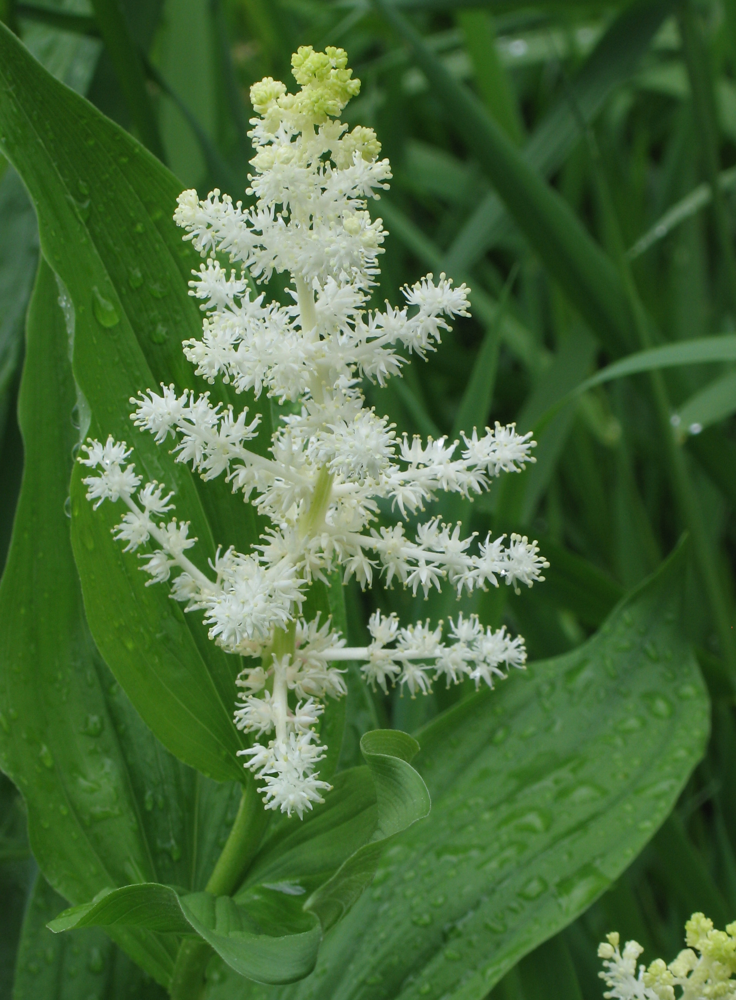

# False Solomon's Seal

*Photo: [Robert Flogaus-Faust](https://commons.wikimedia.org/wiki/File:Maianthemum_racemosum_RF.jpg) | CC BY 4.0*

## Basic information
- **Scientific name:** Maianthemum racemosum (syn. Smilacina racemosa)
- **Plant type:** Perennial
- **USDA zones:** 3-8
- **Native region:** Pacific Northwest and across North America

## Growth characteristics
- **Mature height:** 24-36 inches
- **Mature spread:** 18-24 inches
- **Growth rate:** Medium
- **Lifespan:** Long-lived perennial

## Growing conditions
- **Sun requirements:** Part Shade/Full Shade
- **Water needs:** Medium
- **Soil type:** Rich, humusy, moist
- **Soil pH:** 5.5-7.0

## Seasonal interest
- **Bloom time:** April-June
- **Bloom color:** Creamy white
- **Fall color:** Yellow; red berries
- **Winter interest:** Dormant; attractive berry clusters persist into early winter

## Wildlife value
- **Attracts:** Native bees, small pollinators
- **Host plant for:** N/A
- **Provides:** Berries for birds (thrushes, grouse)

## Planting details
- **Quantity needed:**
- **Location/bed:**
- **Spacing:** 18-24 inches apart
- **Companion plants:** Sword fern, trillium, wild ginger, bleeding heart

## Sourcing
- **Purchase source:**
- **Cost per plant:**
- **Date purchased:**
- **Date planted:**

## Care & maintenance
- **Pruning needs:** Cut back dead stems in late fall or early spring
- **Fertilizer:** Light compost in spring
- **Mulch:** 2-3 inches of leaf mulch
- **Special care:** Keep soil consistently moist; spreads slowly by rhizomes

## Notes
- **Design notes:** Graceful arching stems; fragrant flower plumes at stem tips; attractive red berries in fall
- **Observations:**
- **Challenges:** Berries are mildly toxic to humans (fine for wildlife)

## Sources
- King County Native Plant Guide: https://green2.kingcounty.gov/gonative/Plant.aspx?Act=view&PlantID=84
- Missouri Botanical Garden: https://www.missouribotanicalgarden.org/PlantFinder/PlantFinderDetails.aspx?taxonid=280746
- USDA Plants Database: https://plants.usda.gov/home/plantProfile?symbol=MARA7
- Lady Bird Johnson Wildflower Center: https://www.wildflower.org/plants/result.php?id_plant=mara7
- North Carolina State Extension: https://plants.ces.ncsu.edu/plants/maianthemum-racemosum/
