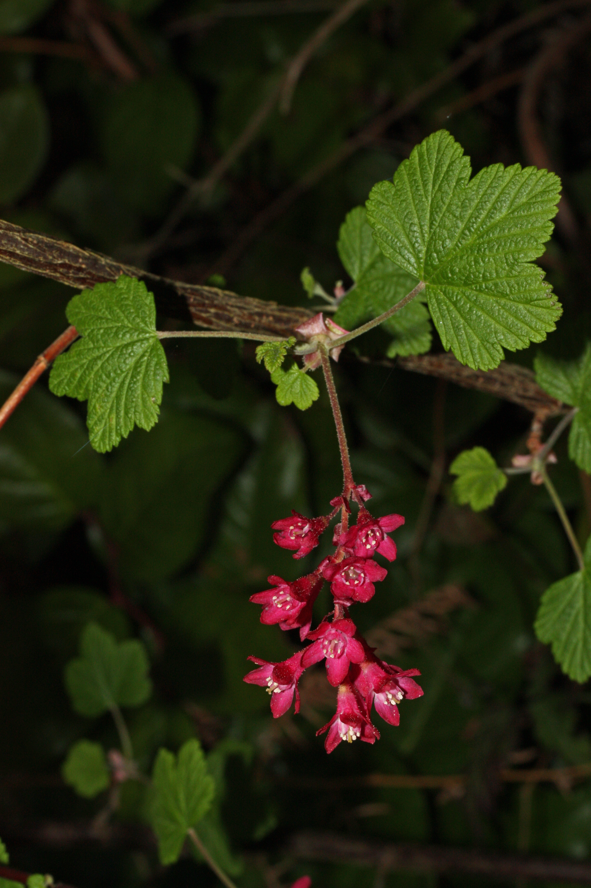

# Flowering Currant

*Photo: [Walter Siegmund](https://commons.wikimedia.org/wiki/File:Ribes_sanguineum_5409.JPG) | CC BY-SA 3.0*

## Basic information
- **Scientific name:** Ribes sanguineum
- **Plant type:** Deciduous Shrub
- **USDA zones:** 5-8
- **Native region:** Pacific Northwest, from British Columbia to California

## Growth characteristics
- **Mature height:** 6 feet
- **Mature spread:** 6-10 feet
- **Growth rate:** Medium-Fast
- **Lifespan:** Long-lived shrub (20+ years)
- **Roots:**

## Growing conditions
- **Sun requirements:** Full Sun/Part Shade
- **Water needs:** Low-Medium (drought tolerant once established)
- **Soil type:** Well-drained; tolerates poor soils
- **Soil pH:** 6.0-7.5
- **Native habitat:**

## Seasonal interest
- **Bloom time:** March-May (one of the earliest spring bloomers)
- **Bloom color:** Carmine red
- **Fall color:** Yellow
- **Winter interest:** Attractive branching structure

## Wildlife value
- **Attracts:** Hummingbirds (especially rufous), native bees, butterflies
- **Host plant for:** Various moth species
- **Provides:** Nectar (critical early spring food source), berries for birds

## Planting details
- **Quantity needed:**
- **Location/bed:**
- **Spacing:** 6-8 feet apart
- **Companion plants:** Sword fern, Oregon grape, salal, red elderberry

## Sourcing
- **Purchase source:**
- **Cost per plant:**
- **Date purchased:**
- **Date planted:**

## Care & maintenance
- **Pruning needs:** Prune after flowering to shape; can rejuvenate by cutting 1/3 of old stems to ground
- **Fertilizer:** Generally not needed
- **Mulch:** 2-3 inches of organic mulch
- **Special care:** Very low maintenance; avoid overwatering

## Notes
- **Design notes:** Outstanding early spring color; excellent hummingbird plant; can be used as informal hedge
- **Observations:**
- **Challenges:** Can get leggy in too much shade; powdery mildew in humid conditions

## Sources
- King County Native Plant Guide: https://green2.kingcounty.gov/gonative/Plant.aspx?Act=view&PlantID=30
- Missouri Botanical Garden: https://www.missouribotanicalgarden.org/PlantFinder/PlantFinderDetails.aspx?taxonid=285475
- USDA Plants Database: https://plants.usda.gov/home/plantProfile?symbol=RISA
- Lady Bird Johnson Wildflower Center: https://www.wildflower.org/plants/result.php?id_plant=risa
- Great Plant Picks: https://www.greatplantpicks.org/plantlists/view/888
