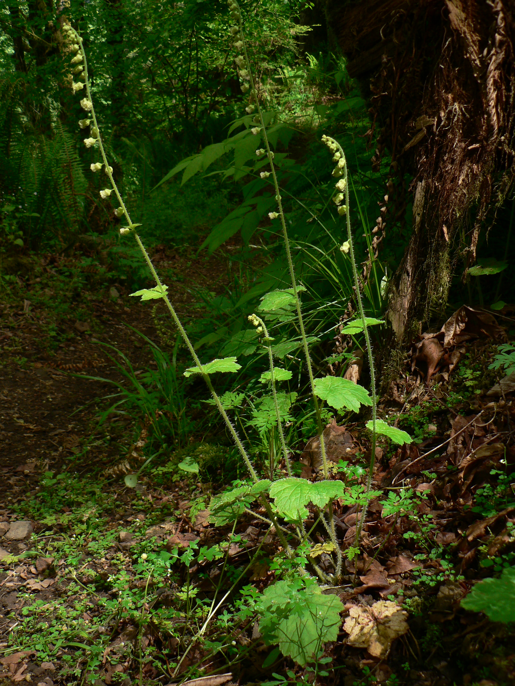

# Fringecup

*Photo: [Walter Siegmund](https://commons.wikimedia.org/wiki/File:Tellima_grandiflora_11202.JPG) | CC BY 2.5*

## Basic information
- **Scientific name:** Tellima grandiflora
- **Plant type:** Perennial
- **USDA zones:** 4-8
- **Native region:** Pacific Northwest, from Alaska to California

## Growth characteristics
- **Mature height:** 12-24 inches (with flower stalks)
- **Mature spread:** 12-18 inches
- **Growth rate:** Medium
- **Lifespan:** Long-lived perennial
- **Roots:**

## Growing conditions
- **Sun requirements:** Part Shade/Full Shade
- **Water needs:** Medium (moist preferred)
- **Soil type:** Adaptable; tolerates clay
- **Soil pH:** 5.5-7.5
- **Native habitat:**

## Seasonal interest
- **Bloom time:** April-June
- **Bloom color:** Greenish-white aging to pink/red
- **Fall color:** Foliage may turn reddish
- **Winter interest:** Semi-evergreen basal rosette

## Wildlife value
- **Attracts:** Native bees, hummingbirds
- **Host plant for:** N/A
- **Provides:** Nectar

## Planting details
- **Quantity needed:**
- **Location/bed:**
- **Spacing:** 12-18 inches apart
- **Companion plants:** Sword fern, bleeding heart, foamflower, wild ginger

## Sourcing
- **Purchase source:**
- **Cost per plant:**
- **Date purchased:**
- **Date planted:**

## Care & maintenance
- **Pruning needs:** Remove spent flower stalks; tidy old leaves in spring
- **Fertilizer:** Generally not needed
- **Mulch:** Light organic mulch
- **Special care:** Very low maintenance; slug resistant

## Notes
- **Design notes:** Fragrant flowers on tall spikes; good vertical element; one of the toughest native shade plants
- **Observations:**
- **Challenges:** Self-seeds readily (can be a pro or con)

## Sources
- King County Native Plant Guide: https://green2.kingcounty.gov/gonative/Plant.aspx?Act=view&PlantID=78
- Missouri Botanical Garden: https://www.missouribotanicalgarden.org/PlantFinder/PlantFinderDetails.aspx?taxonid=286580
- USDA Plants Database: https://plants.usda.gov/home/plantProfile?symbol=TEGR4
- Lady Bird Johnson Wildflower Center: https://www.wildflower.org/plants/result.php?id_plant=tegr4
- Great Plant Picks (PNW): https://www.greatplantpicks.org/plantlists/view/934
