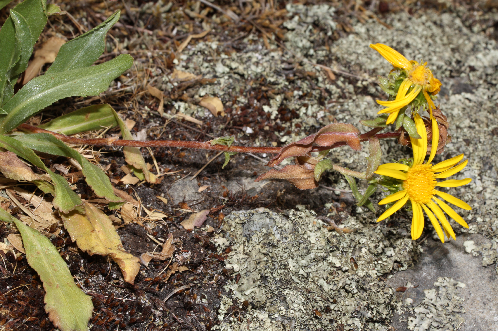

# Gumweed

*Photo: [Author Name](wikimedia-source-url) | License*

## Basic information
- **Scientific name:** Grindelia integrifolia (Puget Sound Gumweed)
- **Plant type:** Herbaceous perennial (Asteraceae)
- **USDA zones:** 
- **Native region:** Pacific coastal areas of the Pacific Northwest (Puget Sound region)

## Growth characteristics
- **Mature height:** 1–4 feet
- **Mature spread:** ~1–2.5 feet
- **Growth rate:** 
- **Lifespan:** 
- **Roots:** 

## Growing conditions
- **Sun requirements:** Full Sun (tolerates light shade)
- **Water needs:** Low (drought tolerant once established — wet in winter, dry in summer; salt-spray tolerant)
- **Soil type:** Sandy to clay, well-drained; tolerant of poor, compacted, and saline soils
- **Soil pH:** 
- **Native habitat:** Coastal bluffs, salt-marsh edges, prairies and meadows

## Seasonal interest
- **Bloom time:** 
- **Bloom color:** 
- **Fall color:** 
- **Winter interest:** 

## Wildlife value
- **Attracts:** 
- **Host plant for:** 
- **Provides:** 

## Planting details
- **Quantity needed:** 
- **Location/bed:** 
- **Spacing:** 
- **Companion plants:** 

## Sourcing
- **Purchase source:** 
- **Cost per plant:** 
- **Date purchased:** 
- **Date planted:** 

## Care & maintenance
- **Pruning needs:** 
- **Fertilizer:** 
- **Mulch:** 
- **Special care:** 

## Notes
- **Design notes:** 
- **Observations:** 
- **Challenges:** 

## Sources
- Fourth Corner Nurseries Wholesale Catalog (Fall 2025/Spring 2026): http://fourthcornernurseries.com
- USDA NRCS Plant Fact Sheet (Grindelia integrifolia): https://plants.usda.gov/DocumentLibrary/factsheet/pdf/fs_grin.pdf
- Washington Native Plant Society: https://www.wnps.org/native-plant-directory/130-grindelia-integrifolia
