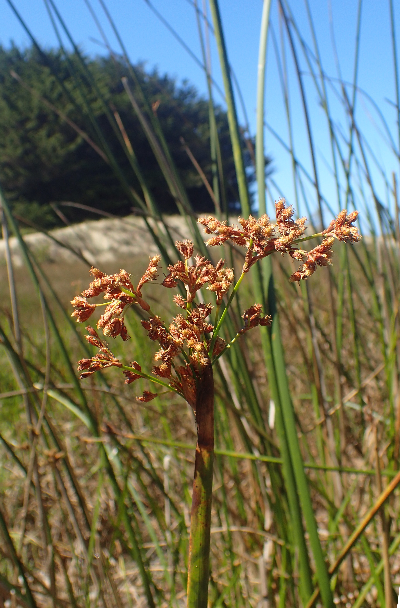

# Hardstem Bulrush

*Photo: [Krzysztof Ziarnek, Kenraiz](https://commons.wikimedia.org/wiki/File%3ASchoenoplectus%20acutus%20kz01.jpg) | CC BY-SA 4.0*

## Basic information
- **Scientific name:** Schoenoplectus acutus
- **Plant type:** Emergent perennial bulrush/sedge (Cyperaceae)
- **USDA zones:** 
- **Native region:** Widespread across North America; PNW (Puget lowland) marshes, lake and pond margins

## Growth characteristics
- **Mature height:** To 6+ feet (≈1.5–3 m)
- **Mature spread:** Strongly rhizomatous; forms dense colonies
- **Growth rate:** Fast (vigorous rhizomatous spreader)
- **Lifespan:** 
- **Roots:** Stout, spreading rhizomes

## Growing conditions
- **Sun requirements:** Full Sun
- **Water needs:** High (emergent aquatic — saturated soil to standing water up to ~5 ft deep)
- **Soil type:** Silts, loams, and organic sediments; tolerant of a range of soils if moist; high salinity tolerance
- **Soil pH:** ~6–8 (tolerates ~5–8)
- **Native habitat:** Freshwater and brackish marshes, lake and pond edges, slow streams

## Seasonal interest
- **Bloom time:** 
- **Bloom color:** 
- **Fall color:** 
- **Winter interest:** 

## Wildlife value
- **Attracts:** 
- **Host plant for:** 
- **Provides:** 

## Planting details
- **Quantity needed:** 
- **Location/bed:** 
- **Spacing:** 
- **Companion plants:** 

## Sourcing
- **Purchase source:** 
- **Cost per plant:** 
- **Date purchased:** 
- **Date planted:** 

## Care & maintenance
- **Pruning needs:** 
- **Fertilizer:** 
- **Mulch:** 
- **Special care:** 

## Notes
- **Design notes:** 
- **Observations:** 
- **Challenges:** 

## Sources
- Fourth Corner Nurseries Wholesale Catalog (Fall 2025/Spring 2026): http://fourthcornernurseries.com
- USU Extension Range Plants: https://extension.usu.edu/rangeplants/grasses-and-grasslikes/hardstem-bulrush
- Lady Bird Johnson Wildflower Center: https://www.wildflower.org/plants/result.php?id_plant=SCACA
- USDA NRCS Plant Guide (Schoenoplectus acutus): https://plants.sc.egov.usda.gov/DocumentLibrary/plantguide/doc/pg_scac3.docx
