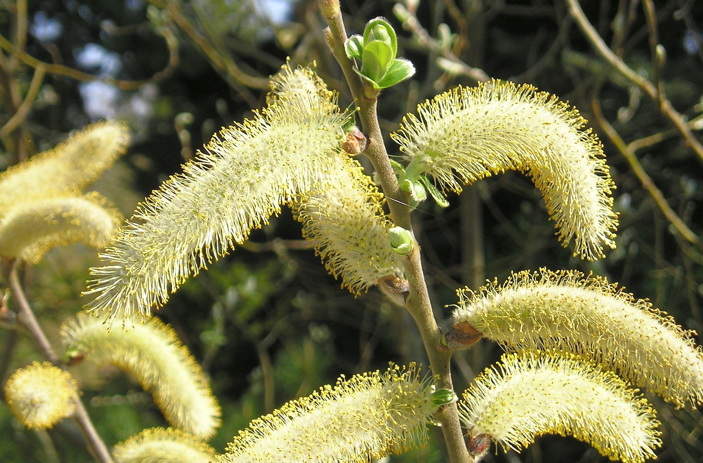

# Hooker's Willow

*Photo: [Author Name](wikimedia-source-url) | License*

## Basic information
- **Scientific name:** Salix hookeriana (Hooker's Willow, Dune Willow)
- **Plant type:** Deciduous shrub (occasionally a small tree)
- **USDA zones:** 
- **Native region:** Coastal western North America, Alaska to northern California

## Growth characteristics
- **Mature height:** To ~20 feet (shrubby growth form; occasionally taller)
- **Mature spread:** ~10–15 feet
- **Growth rate:** Fast
- **Lifespan:** 
- **Roots:** Good for soil/slope stabilization

## Growing conditions
- **Sun requirements:** Full Sun
- **Water needs:** High (coastal wet habitats — moist to wet soils)
- **Soil type:** Sandy, loamy, or clay soils; tolerates saline soils
- **Soil pH:** 
- **Native habitat:** Coastal dunes, estuaries, and riparian/wet sites

## Seasonal interest
- **Bloom time:** 
- **Bloom color:** 
- **Fall color:** 
- **Winter interest:** 

## Wildlife value
- **Attracts:** 
- **Host plant for:** 
- **Provides:** 

## Planting details
- **Quantity needed:** 
- **Location/bed:** 
- **Spacing:** 
- **Companion plants:** 

## Sourcing
- **Purchase source:** 
- **Cost per plant:** 
- **Date purchased:** 
- **Date planted:** 

## Care & maintenance
- **Pruning needs:** 
- **Fertilizer:** 
- **Mulch:** 
- **Special care:** 

## Notes
- **Design notes:** 
- **Observations:** 
- **Challenges:** 

## Sources
- Fourth Corner Nurseries Wholesale Catalog (Fall 2025/Spring 2026): http://fourthcornernurseries.com
- Washington Native Plant Society: https://www.wnps.org/native-plant-directory/342:salix-hookeriana
- USDA NRCS Plant Materials ('Clatsop' Hooker willow): https://www.nrcs.usda.gov/plantmaterials/orpmcrb11958.pdf
