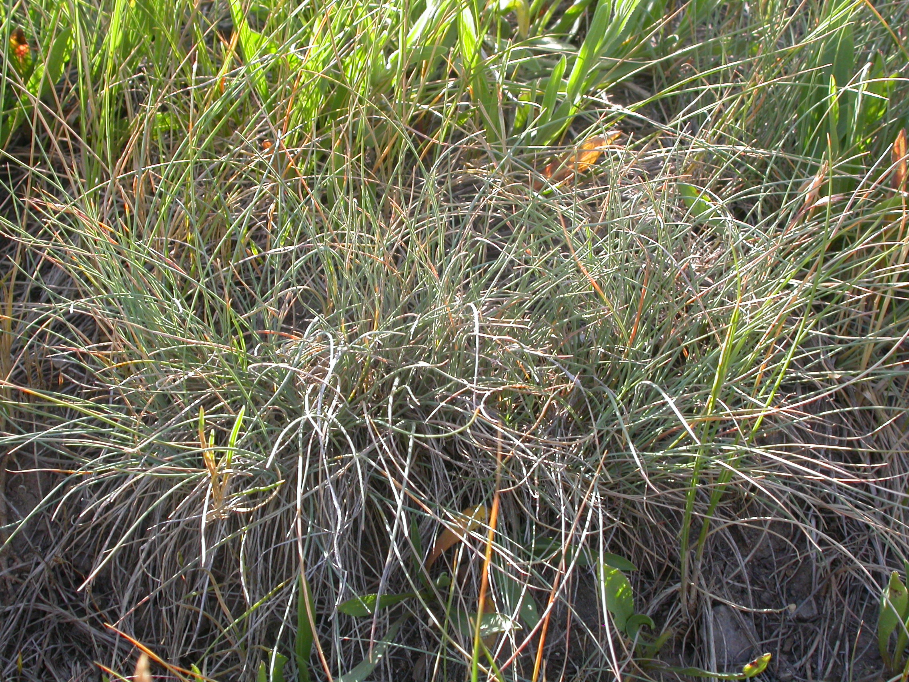

# Idaho Fescue

*Photo: [Matt Lavin](https://commons.wikimedia.org/wiki/File:Festuca_idahoensis_(3750487627).jpg) | CC BY-SA 2.0*

## Basic information
- **Scientific name:** Festuca idahoensis
- **Plant type:** Perennial Bunchgrass
- **USDA zones:** 3-10
- **Native region:** Western North America; Palouse prairie of eastern Oregon/Washington, intermountain valleys

## Growth characteristics
- **Mature height:** 12-32 inches
- **Mature spread:** 12-18 inches
- **Growth rate:** Medium
- **Lifespan:** Long-lived perennial

## Growing conditions
- **Sun requirements:** Full Sun/Part Shade
- **Water needs:** Low-Medium (drought tolerant once established)
- **Soil type:** Adaptable; tolerates sand, loam, and clay with good drainage
- **Soil pH:** 6.0-8.0

## Seasonal interest
- **Bloom time:** May-July
- **Bloom color:** Green to straw-colored seed heads
- **Fall color:** Blue-green to straw
- **Winter interest:** Persistent fine-textured foliage

## Wildlife value
- **Attracts:** Birds (seeds)
- **Host plant for:** Castilleja species (preferred host); various native moths and butterflies
- **Provides:** Seeds for birds; nesting material; excellent forage for wildlife

## Planting details
- **Quantity needed:**
- **Location/bed:**
- **Spacing:** 12-18 inches apart
- **Companion plants:** Other prairie plants, wildflowers, sedges

## Sourcing
- **Purchase source:**
- **Cost per plant:**
- **Date purchased:**
- **Date planted:**

## Care & maintenance
- **Pruning needs:** Cut back in late winter before new growth
- **Fertilizer:** None needed; tolerates low-fertility soils
- **Mulch:** Optional; prefers well-drained conditions
- **Special care:** Deep root system excellent for erosion control; do not overwater

## Notes
- **Design notes:** Fine-textured blue-green bunchgrass; excellent for meadow plantings, living mulch, and erosion control; provides year-round structure
- **Observations:**
- **Challenges:** Does not tolerate flooding or high water tables; susceptible to overgrazing

## Sources
- USDA Plants Database: https://plants.usda.gov/DocumentLibrary/plantguide/pdf/pg_feid.pdf
- Lady Bird Johnson Wildflower Center: https://www.wildflower.org/plants/result.php?id_plant=FEID
- Gardenia: https://www.gardenia.net/plant/festuca-idahoensis
