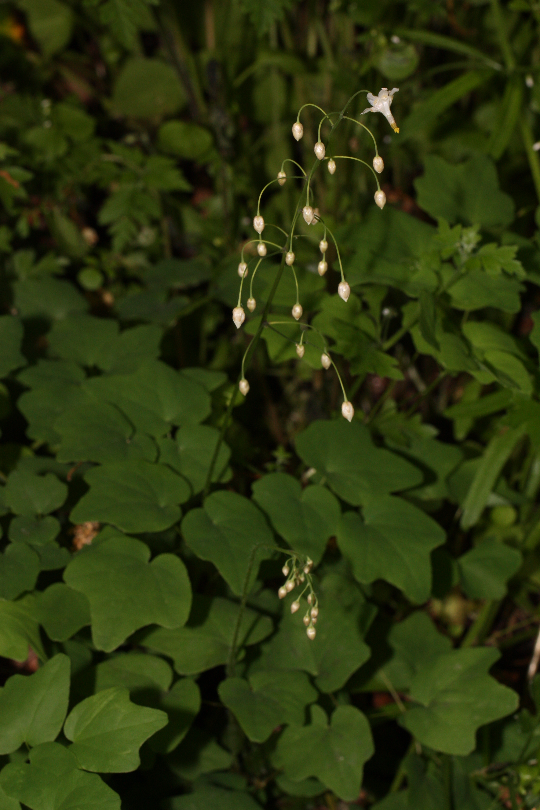

# Inside-out Flower

*Photo: [Walter Siegmund](https://commons.wikimedia.org/wiki/File:Vancouveria_hexandra_6356.JPG) | CC BY-SA 3.0*

## Basic information
- **Scientific name:** Vancouveria hexandra
- **Plant type:** Perennial/Groundcover
- **USDA zones:** 5-8
- **Native region:** Pacific Northwest, from Washington to California

## Growth characteristics
- **Mature height:** 8-16 inches
- **Mature spread:** 12-24 inches (spreads by rhizomes)
- **Growth rate:** Medium
- **Lifespan:** Long-lived perennial

## Growing conditions
- **Sun requirements:** Part Shade/Full Shade
- **Water needs:** Low-Medium
- **Soil type:** Well-drained, humusy
- **Soil pH:** 5.5-7.0

## Seasonal interest
- **Bloom time:** May-June
- **Bloom color:** White
- **Fall color:** Deciduous; foliage yellows
- **Winter interest:** Dormant

## Wildlife value
- **Attracts:** Native bees, small pollinators
- **Host plant for:** N/A
- **Provides:** Nectar, groundcover shelter

## Planting details
- **Quantity needed:**
- **Location/bed:**
- **Spacing:** 12 inches apart
- **Companion plants:** Sword fern, wild ginger, trillium, fringecup

## Sourcing
- **Purchase source:**
- **Cost per plant:**
- **Date purchased:**
- **Date planted:**

## Care & maintenance
- **Pruning needs:** None required; remove dead foliage in spring
- **Fertilizer:** Generally not needed
- **Mulch:** Light leaf mulch
- **Special care:** More drought-tolerant than many shade plants once established

## Notes
- **Design notes:** Delicate, airy appearance; dainty white flowers with reflexed petals resemble tiny shooting stars
- **Observations:**
- **Challenges:** Slow to establish but spreads reliably once happy

## Sources
- King County Native Plant Guide: https://green2.kingcounty.gov/gonative/Plant.aspx?Act=view&PlantID=42
- Lady Bird Johnson Wildflower Center: https://www.wildflower.org/plants/result.php?id_plant=vahe
- USDA Plants Database: https://plants.usda.gov/home/plantProfile?symbol=VAHE
- Calflora: https://www.calflora.org/app/taxon?crn=8054
- Portland Plant List: https://www.portlandoregon.gov/bes/article/148607
