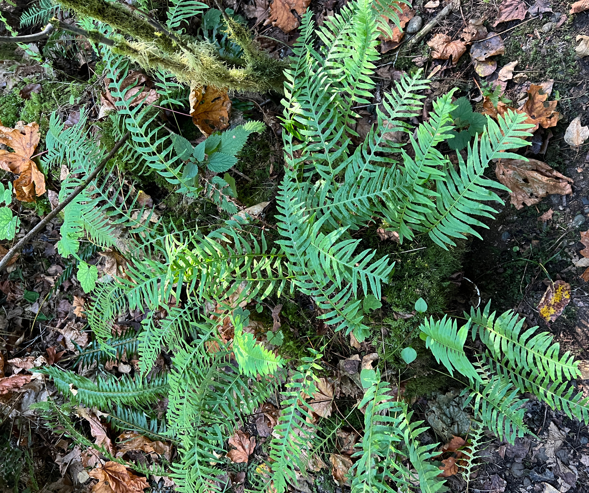

# Licorice Fern

*Photo: [Jhorthos](https://commons.wikimedia.org/wiki/File%3APolypodium%20glycyrrhiza%20JHT%20IMG%208646.jpg) | CC BY-SA 4.0*

## Basic information
- **Scientific name:** Polypodium glycyrrhiza
- **Plant type:** Summer-deciduous fern
- **USDA zones:** 
- **Native region:** Pacific Northwest — Alaska and British Columbia south to California, east to Idaho

## Growth characteristics
- **Mature height:** 6–12 inches (fronds to ~12 in)
- **Mature spread:** ~1.5 feet; spreads by creeping rhizomes
- **Growth rate:** Medium
- **Lifespan:** 
- **Roots:** Creeping rhizome (often epiphytic on mossy logs, rocks, and bigleaf maple)

## Growing conditions
- **Sun requirements:** Part Shade to Full Shade (tolerates full sun with ample moisture)
- **Water needs:** Medium (consistent moisture in the growing season; summer-dormant — little to no summer water)
- **Soil type:** Well-drained, rich in organic matter; tolerates a range of soils where moisture is adequate
- **Soil pH:** Slightly acidic to neutral
- **Native habitat:** Moist, shaded woodlands; mossy logs, rocks, and tree trunks

## Seasonal interest
- **Bloom time:** 
- **Bloom color:** 
- **Fall color:** 
- **Winter interest:** Fronds are lush and green through the wet winter months

## Wildlife value
- **Attracts:** 
- **Host plant for:** 
- **Provides:** 

## Planting details
- **Quantity needed:** 
- **Location/bed:** 
- **Spacing:** 
- **Companion plants:** 

## Sourcing
- **Purchase source:** MSK Nursery
- **Cost per plant:** 
- **Date purchased:** 2026-07-05
- **Date planted:** 2026-07-05

## Care & maintenance
- **Pruning needs:** 
- **Fertilizer:** 
- **Mulch:** 
- **Special care:** 

## Notes
- **Design notes:** 
- **Observations:** 
- **Challenges:** 

## Sources
- Hardy Fern Foundation: https://hardyferns.org/ferns/polypodium-glycyrrhiza/
- Native Plant Salvage Foundation: https://www.nativeplantsalvage.org/native-plant-database/p/pol-gly
- Plants For A Future (PFAF): https://pfaf.org/user/Plant.aspx?LatinName=Polypodium+glycyrrhiza
