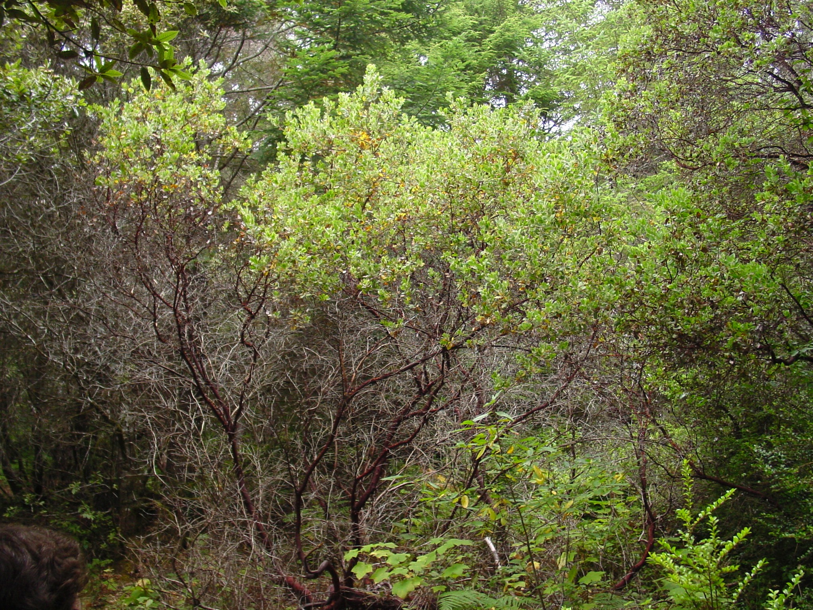

# Manzanita

*Photo: [NoahElhardt](https://commons.wikimedia.org/wiki/File:Arctostaphylos_columbiana.jpg) | CC BY-SA 2.5*

## Basic information
- **Scientific name:** Arctostaphylos columbiana (Hairy Manzanita)
- **Plant type:** Evergreen Shrub
- **USDA zones:** 7-9
- **Native region:** Pacific Northwest, from British Columbia to California

## Growth characteristics
- **Mature height:** 3-10 feet
- **Mature spread:** 6-10 feet
- **Growth rate:** Slow
- **Lifespan:** Very long-lived (50+ years)

## Growing conditions
- **Sun requirements:** Full Sun/Part Sun
- **Water needs:** Low (very drought tolerant once established)
- **Soil type:** Well-drained, sandy or rocky; intolerant of wet soils
- **Soil pH:** 5.0-7.0

## Seasonal interest
- **Bloom time:** March-May
- **Bloom color:** White to pink, urn-shaped clusters
- **Fall color:** Evergreen
- **Winter interest:** Striking smooth red-brown bark; evergreen foliage

## Wildlife value
- **Attracts:** Hummingbirds, native bees, butterflies
- **Host plant for:** Brown elfin and other Lycaenid butterflies
- **Provides:** Early nectar; berries for birds and mammals; cover

## Planting details
- **Quantity needed:**
- **Location/bed:**
- **Spacing:** 6-8 feet apart
- **Companion plants:** Oregon grape, ceanothus, native grasses, yarrow

## Sourcing
- **Purchase source:**
- **Cost per plant:**
- **Date purchased:**
- **Date planted:**

## Care & maintenance
- **Pruning needs:** Minimal; prune only to shape when young; avoid cutting into old wood
- **Fertilizer:** None - avoid fertilizing
- **Mulch:** Gravel or rock mulch; avoid organic mulch against stem
- **Special care:** Do NOT overwater; excellent drainage critical; do not disturb roots once established

## Notes
- **Design notes:** Sculptural form; beautiful bark; excellent drought-tolerant evergreen; many PNW Arctostaphylos species available
- **Observations:**
- **Challenges:** Sensitive to summer water and poor drainage; can be difficult to establish; avoid planting too deep

## Sources
- USDA Plants Database: https://plants.usda.gov/home/plantProfile?symbol=ARCO5
- Lady Bird Johnson Wildflower Center: https://www.wildflower.org/plants/result.php?id_plant=arco5
- Oregon State University Landscape Plants: https://landscapeplants.oregonstate.edu/plants/arctostaphylos-columbiana
- Great Plant Picks: https://www.greatplantpicks.org/plantlists/view/5
