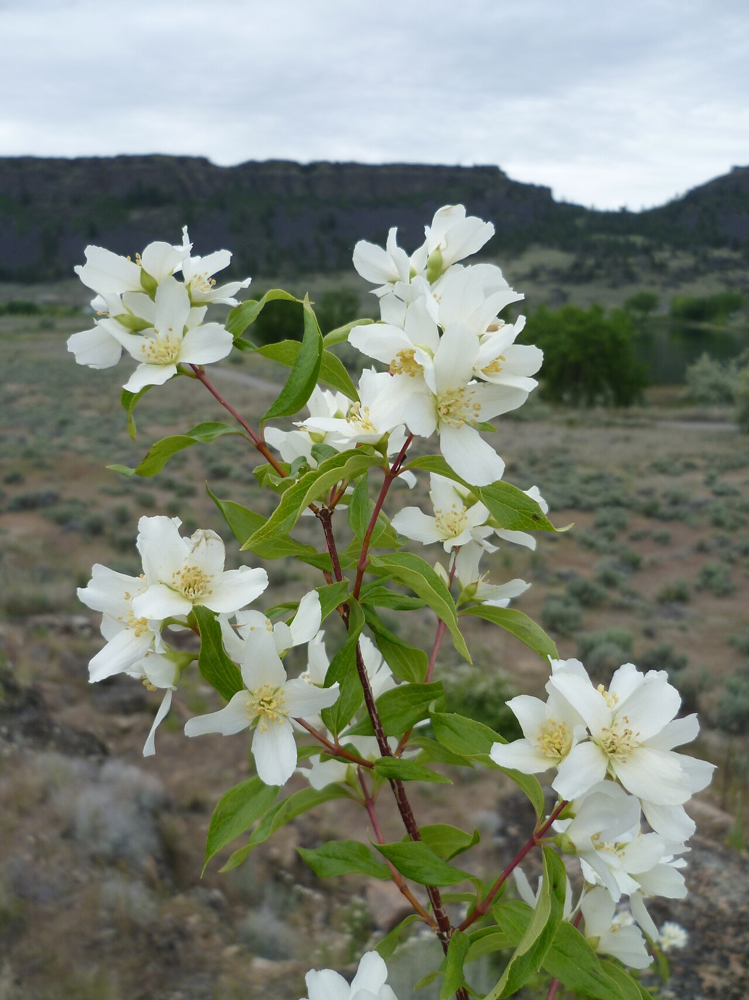

# Mock Orange

*Photo: [Walter Siegmund](https://commons.wikimedia.org/wiki/File:Philadelphus_lewisii_8739.JPG) | CC BY-SA 3.0*

## Basic information
- **Scientific name:** Philadelphus lewisii
- **Plant type:** Deciduous Shrub
- **USDA zones:** 4-8
- **Native region:** Pacific Northwest, from British Columbia south to northern California and east to Montana

## Growth characteristics
- **Mature height:** 4-10 feet (occasionally to 12 feet)
- **Mature spread:** 5-8 feet
- **Growth rate:** Medium-Fast
- **Lifespan:** Long-lived shrub
- **Roots:**

## Growing conditions
- **Sun requirements:** Full Sun/Part Shade
- **Water needs:** Low-Medium (drought tolerant once established)
- **Soil type:** Adaptable; tolerates rocky, dry soils; prefers well-drained
- **Soil pH:** 6.0-8.0
- **Native habitat:** Streambanks, rocky slopes, open woodlands, and forest edges

## Seasonal interest
- **Bloom time:** May-July
- **Bloom color:** White, four-petaled, fragrant (orange-blossom scent)
- **Fall color:** Yellow
- **Winter interest:** Arching branch structure; exfoliating bark on older stems

## Wildlife value
- **Attracts:** Native bees, bumblebees, butterflies, hummingbirds
- **Host plant for:**
- **Provides:** Nectar and pollen; cover and nesting sites for birds; browsed by deer and elk

## Planting details
- **Quantity needed:**
- **Location/bed:**
- **Spacing:** 5-8 feet apart
- **Companion plants:** Ocean spray, serviceberry, snowberry, Oregon grape, flowering currant

## Sourcing
- **Purchase source:**
- **Cost per plant:**
- **Date purchased:**
- **Date planted:**

## Care & maintenance
- **Pruning needs:** Prune just after flowering; blooms on previous year's wood; remove oldest stems at base to rejuvenate
- **Fertilizer:** None needed
- **Mulch:** Optional
- **Special care:** Tolerates pruning well; can be cut back hard to rejuvenate

## Notes
- **Design notes:** Washington's state flower; intensely fragrant white blooms in early summer; classic native shrub for borders and screens
- **Observations:**
- **Challenges:** Can look sparse in winter; may sucker

## Sources
- King County Native Plant Guide: https://green2.kingcounty.gov/gonative/Plant.aspx?Act=view&PlantID=64
- USDA Plants Database: https://plants.usda.gov/home/plantProfile?symbol=PHLE4
- Lady Bird Johnson Wildflower Center: https://www.wildflower.org/plants/result.php?id_plant=phle4
- Oregon State University Landscape Plants: https://landscapeplants.oregonstate.edu/plants/philadelphus-lewisii
- WSU Clark County Extension: https://s3.wp.wsu.edu/uploads/sites/2073/2014/05/Mock-Orange.pdf
