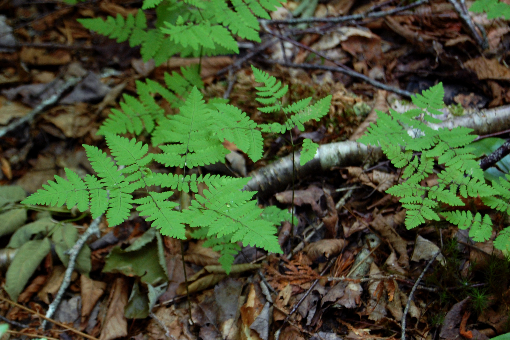

# Oak Fern

*Photo: [jillllybean](https://commons.wikimedia.org/wiki/File:Gymnocarpium_dryopteris_(16309554346)_(cropped).jpg) | CC BY-SA 2.0*

## Basic information
- **Scientific name:** Gymnocarpium dryopteris
- **Plant type:** Deciduous Fern
- **USDA zones:** 2-9
- **Native region:** Pacific Northwest, across northern North America; both sides of the Cascades

## Growth characteristics
- **Mature height:** 4-10 inches
- **Mature spread:** 12 inches (spreads by rhizomes)
- **Growth rate:** Slow
- **Lifespan:** Long-lived perennial

## Growing conditions
- **Sun requirements:** Part Shade/Full Shade
- **Water needs:** Medium-High (needs consistent moisture)
- **Soil type:** Humus-rich, moist; tolerates sandy and loamy soils
- **Soil pH:** 5.0-7.5 (mildly acid to neutral)

## Seasonal interest
- **Bloom time:** N/A (fern)
- **Bloom color:** N/A
- **Fall color:** Yellow before going dormant
- **Winter interest:** Deciduous; dies back in winter

## Wildlife value
- **Attracts:** Provides habitat for small wildlife
- **Host plant for:** Various insects
- **Provides:** Groundcover and shelter

## Planting details
- **Quantity needed:**
- **Location/bed:**
- **Spacing:** 12 inches apart
- **Companion plants:** Other shade-loving ferns, wild ginger, inside-out flower

## Sourcing
- **Purchase source:**
- **Cost per plant:**
- **Date purchased:**
- **Date planted:**

## Care & maintenance
- **Pruning needs:** Remove dead fronds in late winter/early spring
- **Fertilizer:** None needed; benefits from leaf mulch
- **Mulch:** Organic mulch to retain moisture
- **Special care:** Needs consistent moisture; does not tolerate drought or hot summers

## Notes
- **Design notes:** Delicate, lacy appearance; excellent groundcover for moist, shaded areas; spreads by creeping rhizomes to form colonies
- **Observations:**
- **Challenges:** Intolerant of drought and hot summers; needs consistent moisture

## Sources
- Washington Native Plant Society: https://www.wnps.org/native-plant-directory/131-gymnocarpium-dryopteris
- Lady Bird Johnson Wildflower Center: https://www.wildflower.org/plants/result.php?id_plant=GYDR
- Great Plant Picks: https://www.greatplantpicks.org/plantlists/view/722
