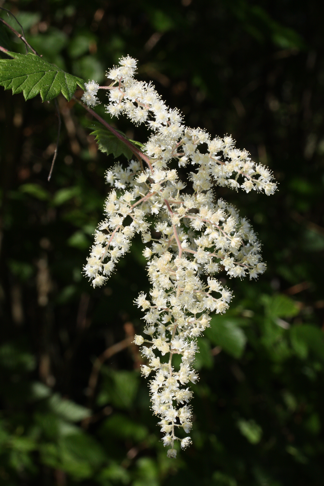

# Ocean Spray

*Photo: [Walter Siegmund](https://commons.wikimedia.org/wiki/File:Holodiscus_discolor_3007.JPG) | CC BY-SA 3.0*

## Basic information
- **Scientific name:** Holodiscus discolor
- **Plant type:** Deciduous Shrub
- **USDA zones:** 6-9
- **Native region:** Pacific Northwest, from British Columbia to California and east to Montana

## Growth characteristics
- **Mature height:** 6-15 feet
- **Mature spread:** 6-10 feet
- **Growth rate:** Medium-Fast
- **Lifespan:** Long-lived shrub (20+ years)
- **Roots:**

## Growing conditions
- **Sun requirements:** Full Sun/Part Shade
- **Water needs:** Low (very drought tolerant once established)
- **Soil type:** Adaptable; tolerates poor, rocky, dry soils
- **Soil pH:** 5.5-7.5
- **Native habitat:**

## Seasonal interest
- **Bloom time:** June-August
- **Bloom color:** Creamy white, cascading plumes
- **Fall color:** Tan/brown; dried flower clusters persist
- **Winter interest:** Dried seed plumes; arching branch structure

## Wildlife value
- **Attracts:** Native bees, butterflies, beneficial insects
- **Host plant for:** Spring azure butterfly, various moth species
- **Provides:** Nectar; seeds for birds; cover and nesting sites

## Planting details
- **Quantity needed:**
- **Location/bed:**
- **Spacing:** 6-8 feet apart
- **Companion plants:** Snowberry, Oregon grape, serviceberry, native roses

## Sourcing
- **Purchase source:**
- **Cost per plant:**
- **Date purchased:**
- **Date planted:**

## Care & maintenance
- **Pruning needs:** Minimal; remove dead wood; can cut back hard to rejuvenate
- **Fertilizer:** None needed
- **Mulch:** Optional; tolerates dry conditions
- **Special care:** Very low maintenance; extremely drought tolerant once established

## Notes
- **Design notes:** Dramatic cascading white flower plumes in summer; excellent for dry, difficult sites; attractive to pollinators; dried flowers add winter interest
- **Observations:**
- **Challenges:** Can spread by root suckers; may look sparse in winter

## Sources
- King County Native Plant Guide: https://green2.kingcounty.gov/gonative/Plant.aspx?Act=view&PlantID=25
- USDA Plants Database: https://plants.usda.gov/home/plantProfile?symbol=HODI
- Lady Bird Johnson Wildflower Center: https://www.wildflower.org/plants/result.php?id_plant=hodi
- Oregon State University Landscape Plants: https://landscapeplants.oregonstate.edu/plants/holodiscus-discolor
