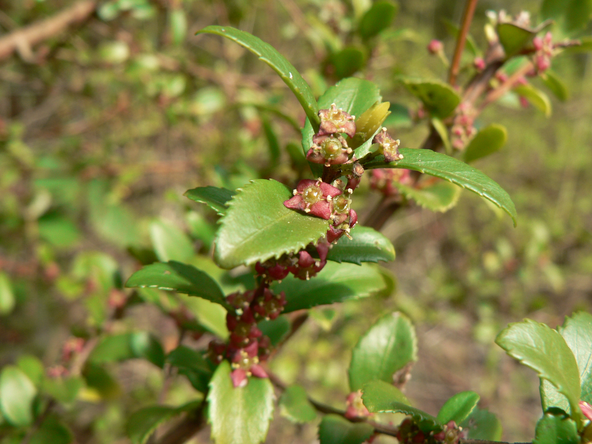

# Oregon Boxwood

*Photo: [Walter Siegmund](https://commons.wikimedia.org/wiki/File:Paxistima_myrsinites_38584.JPG) | CC BY 2.5*

## Basic information
- **Scientific name:** Paxistima myrsinites (syn. Pachistima myrsinites)
- **Plant type:** Evergreen Shrub
- **USDA zones:** 4-8
- **Native region:** Pacific Northwest, from British Columbia to California and Rocky Mountains

## Growth characteristics
- **Mature height:** 1-3 feet
- **Mature spread:** 2-4 feet
- **Growth rate:** Slow
- **Lifespan:** Long-lived shrub

## Growing conditions
- **Sun requirements:** Part Shade/Full Shade (tolerates sun with moisture)
- **Water needs:** Low-Medium
- **Soil type:** Well-drained, humusy; tolerates rocky soils
- **Soil pH:** 5.5-7.0

## Seasonal interest
- **Bloom time:** April-June
- **Bloom color:** Tiny, fragrant, reddish-brown (inconspicuous)
- **Fall color:** Evergreen; may bronze slightly in winter
- **Winter interest:** Glossy evergreen foliage year-round

## Wildlife value
- **Attracts:** Small pollinators
- **Host plant for:** N/A
- **Provides:** Cover for small wildlife; nesting sites

## Planting details
- **Quantity needed:**
- **Location/bed:**
- **Spacing:** 2-3 feet apart
- **Companion plants:** Sword fern, wild ginger, rhododendron, Oregon grape

## Sourcing
- **Purchase source:**
- **Cost per plant:**
- **Date purchased:**
- **Date planted:**

## Care & maintenance
- **Pruning needs:** Minimal; light shearing to shape if desired; tolerates pruning well
- **Fertilizer:** Light compost in spring if desired
- **Mulch:** 2 inches of organic mulch
- **Special care:** Very low maintenance once established

## Notes
- **Design notes:** Native alternative to boxwood; glossy small leaves; excellent low hedge, border, or foundation plant; tolerates pruning into formal shapes
- **Observations:**
- **Challenges:** Can be slow to establish; may be difficult to find in nurseries

## Sources
- USDA Plants Database: https://plants.usda.gov/home/plantProfile?symbol=PAMY
- Lady Bird Johnson Wildflower Center: https://www.wildflower.org/plants/result.php?id_plant=pamy
- Oregon State University Landscape Plants: https://landscapeplants.oregonstate.edu/plants/paxistima-myrsinites
- Native Plants PNW: https://nativeplantspnw.com/oregon-boxwood-paxistima-myrsinites/
