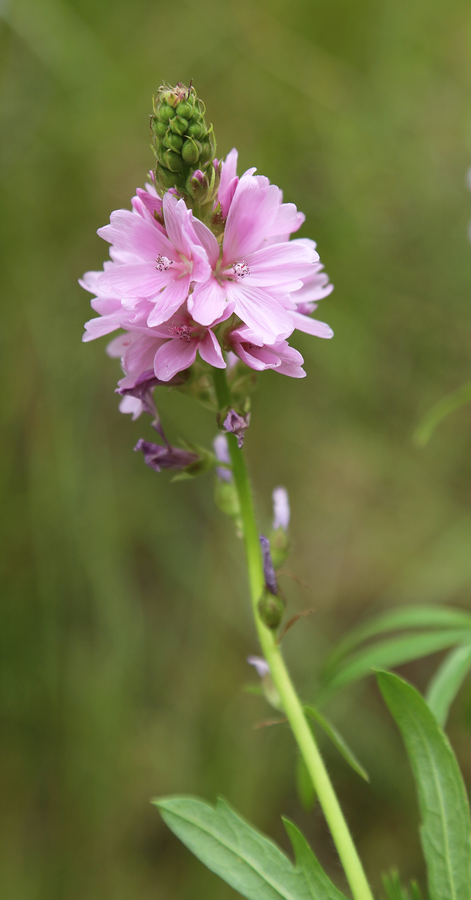

# Oregon Checkermallow

*Photo: [Dcrjsr](https://commons.wikimedia.org/wiki/File:Oregon_checkerbloom_flowerstalk.jpg) | CC BY 4.0*

## Basic information
- **Scientific name:** Sidalcea oregana
- **Plant type:** Herbaceous Perennial
- **USDA zones:** 5-9
- **Native region:** Pacific Northwest; Oregon, Washington, California, and intermountain West

## Growth characteristics
- **Mature height:** 2-4 feet
- **Mature spread:** 12-18 inches
- **Growth rate:** Medium
- **Lifespan:** Long-lived perennial
- **Roots:** Taprooted

## Growing conditions
- **Sun requirements:** Full Sun/Part Shade
- **Water needs:** Medium-High (not drought tolerant; prefers moist conditions)
- **Soil type:** Sandy or loamy; does not grow well in clay
- **Soil pH:** 6.0-7.5
- **Native habitat:**

## Seasonal interest
- **Bloom time:** May-July
- **Bloom color:** Rose pink
- **Fall color:** None significant
- **Winter interest:** Dies back; basal foliage may persist

## Wildlife value
- **Attracts:** Native bees, butterflies, beneficial insects
- **Host plant for:** Various native butterflies
- **Provides:** High-quality nectar and pollen for pollinators

## Planting details
- **Quantity needed:**
- **Location/bed:**
- **Spacing:** 12-18 inches apart
- **Companion plants:** Other wet meadow plants, grasses, sedges

## Sourcing
- **Purchase source:**
- **Cost per plant:**
- **Date purchased:**
- **Date planted:**

## Care & maintenance
- **Pruning needs:** Deadhead to extend bloom season; cut back in fall
- **Fertilizer:** None needed
- **Mulch:** Light mulch to retain moisture
- **Special care:** Needs consistent moisture; best in wet meadow conditions or with regular irrigation

## Notes
- **Design notes:** Showy hollyhock-like flowers; excellent for pollinator gardens, wet meadows, and streamside plantings; resembles miniature hollyhocks
- **Observations:**
- **Challenges:** Not drought tolerant; needs moist conditions; some varieties are endangered

## Sources
- Portland Nursery: https://www.portlandnursery.com/natives/sidalcea
- Calscape: https://calscape.org/Sidalcea-oregana-(Oregon-Checker-Mallow)
- Oregon Flora: https://oregonflora.org/taxa/garden.php?taxon=8390
