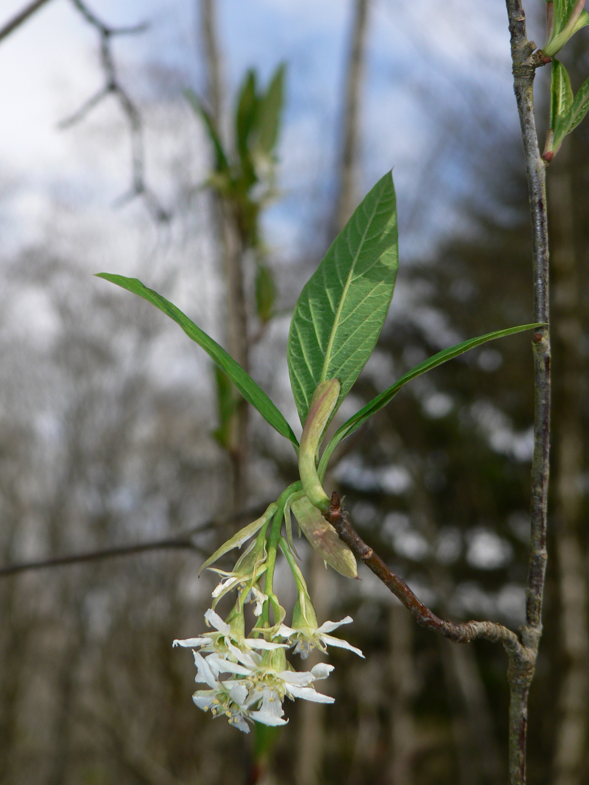

# Osoberry

*Photo: [Walter Siegmund](https://commons.wikimedia.org/wiki/File%3AOemleria%20cerasiformis%2004012.JPG) | CC BY 2.5*

## Basic information
- **Scientific name:** Oemleria cerasiformis
- **Plant type:** Shrub
- **USDA zones:** 6-9
- **Native region:** Pacific Coast, British Columbia to California

## Growth characteristics
- **Mature height:** 6-15 ft
- **Mature spread:** 6-12 ft
- **Growth rate:** Medium to Fast
- **Lifespan:** Long-lived
- **Roots:** Spreads by root suckers to form thickets

## Growing conditions
- **Sun requirements:** Part Shade/Full Shade (tolerates full sun with moisture)
- **Water needs:** Medium (drought tolerant once established)
- **Soil type:** Adaptable; prefers moist, well-drained
- **Soil pH:** 5.5-7.5
- **Native habitat:** Forest edges, streambanks, moist woods

## Seasonal interest
- **Bloom time:** February-April (one of the earliest bloomers)
- **Bloom color:** White to greenish-white
- **Fall color:** Yellow
- **Winter interest:** Early fragrant flowers

## Wildlife value
- **Attracts:** Early pollinators, birds
- **Host plant for:**
- **Provides:** Early nectar source, berries for birds

## Planting details
- **Quantity needed:**
- **Location/bed:**
- **Spacing:** 6-10 ft
- **Companion plants:** Red flowering currant, salal, sword fern

## Sourcing
- **Purchase source:** Go Natives! Nursery (Shoreline) - https://gonativesnursery.company.site
- **Cost per plant:** $14.00
- **Date purchased:**
- **Date planted:**

## Care & maintenance
- **Pruning needs:** Prune suckers to control spread; can rejuvenate by cutting to ground
- **Fertilizer:** Generally not needed
- **Mulch:** Organic mulch beneficial
- **Special care:** Dioecious - need male and female plants for fruit

## Notes
- **Design notes:**
- **Observations:**
- **Challenges:**
