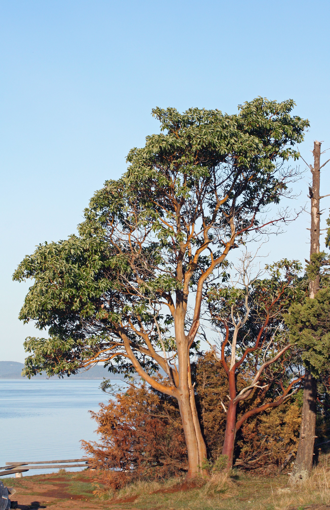

# Pacific Madrone

*Photo: [Walter Siegmund](https://commons.wikimedia.org/wiki/File%3AArbutus%20menziesii%205822.JPG) | CC BY-SA 3.0*

## Basic information
- **Scientific name:** Arbutus menziesii
- **Plant type:** Evergreen Tree
- **USDA zones:** 7-9
- **Native region:** Pacific Coast from British Columbia to Southern California

## Growth characteristics
- **Mature height:** 20-80 feet (often 30-50 feet in cultivation)
- **Mature spread:** 20-50 feet
- **Growth rate:** Slow to Medium
- **Lifespan:** Long-lived (200+ years)
- **Roots:** Deep taproot; sensitive to disturbance

## Growing conditions
- **Sun requirements:** Full Sun/Part Sun
- **Water needs:** Low (drought tolerant once established)
- **Soil type:** Well-drained; tolerates poor, rocky soils
- **Soil pH:** 5.0-7.0
- **Native habitat:** Dry, rocky slopes and forest edges; often found with Douglas fir and oak woodlands

## Seasonal interest
- **Bloom time:** March-May
- **Bloom color:** White to pinkish, urn-shaped clusters
- **Fall color:** Evergreen; red-orange berries in fall
- **Winter interest:** Striking smooth, peeling reddish-brown bark; evergreen foliage

## Wildlife value
- **Attracts:** Native bees, butterflies, birds
- **Host plant for:** Brown elfin butterfly, echo blue butterfly
- **Provides:** Berries for birds (band-tailed pigeons, cedar waxwings, varied thrush); nectar for pollinators; nesting sites

## Planting details
- **Quantity needed:**
- **Location/bed:**
- **Spacing:** 20-30 feet apart
- **Companion plants:** Douglas fir, Oregon white oak, manzanita, salal, sword fern

## Sourcing
- **Purchase source:**
- **Cost per plant:**
- **Date purchased:**
- **Date planted:**

## Care & maintenance
- **Pruning needs:** Minimal; avoid heavy pruning
- **Fertilizer:** None needed; avoid fertilizing
- **Mulch:** Light mulch away from trunk; avoid burying root crown
- **Special care:** Do not disturb roots after planting; avoid summer irrigation once established; plant small specimens (1-gallon or less) for best survival

## Notes
- **Design notes:** One of the most beautiful native trees with its distinctive peeling cinnamon-red bark and glossy evergreen leaves; excellent for dry, sunny slopes; provides year-round interest
- **Observations:**
- **Challenges:** Difficult to transplant due to sensitive taproot; susceptible to fungal leaf diseases in wet conditions; best planted from seed or small container stock

## Sources
- Oregon State University Landscape Plants: https://landscapeplants.oregonstate.edu/plants/arbutus-menziesii
- USDA Plants Database: https://plants.usda.gov/home/plantProfile?symbol=ARME
- California Native Plant Society: https://calscape.org/Arbutus-menziesii-()
- Washington Native Plant Society: https://www.wnps.org/
