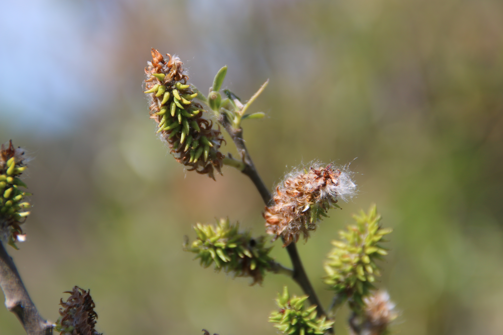

# Pacific Willow

*Photo: [Joe Decruyenaere](https://commons.wikimedia.org/wiki/File%3ASalix%20lasiandra%20%28Pacific%20Willow%29%2C%20Santa%20Rosa%20Plateau%2C%20Riverside%20County%2C%20California%20%2833627381326%29.jpg) | CC BY-SA 2.0*

## Basic information
- **Scientific name:** Salix lucida ssp. lasiandra (syn. Salix lasiandra)
- **Plant type:** Deciduous tree or large shrub (largest native PNW willow)
- **USDA zones:** 
- **Native region:** Across North America; western riparian areas

## Growth characteristics
- **Mature height:** To 40–60 feet (often shorter)
- **Mature spread:** Upright and spreading
- **Growth rate:** Fast
- **Lifespan:** 
- **Roots:** Excellent soil-binding (used for streambank stabilization)

## Growing conditions
- **Sun requirements:** Full Sun
- **Water needs:** High (moist to wet soils; flood tolerant)
- **Soil type:** Moist to wet gravelly, sandy, or clay soils
- **Soil pH:** 
- **Native habitat:** Floodplains, streambanks, and other wet habitats

## Seasonal interest
- **Bloom time:** 
- **Bloom color:** 
- **Fall color:** 
- **Winter interest:** 

## Wildlife value
- **Attracts:** 
- **Host plant for:** 
- **Provides:** 

## Planting details
- **Quantity needed:** 
- **Location/bed:** 
- **Spacing:** 
- **Companion plants:** 

## Sourcing
- **Purchase source:** 
- **Cost per plant:** 
- **Date purchased:** 
- **Date planted:** 

## Care & maintenance
- **Pruning needs:** 
- **Fertilizer:** 
- **Mulch:** 
- **Special care:** 

## Notes
- **Design notes:** 
- **Observations:** 
- **Challenges:** 

## Sources
- Fourth Corner Nurseries Wholesale Catalog (Fall 2025/Spring 2026): http://fourthcornernurseries.com
- Lady Bird Johnson Wildflower Center: https://www.wildflower.org/plants/result.php?id_plant=SALUL
- Washington Native Plant Society: https://www.wnps.org/native-plant-directory/234:salix-lasiandra
