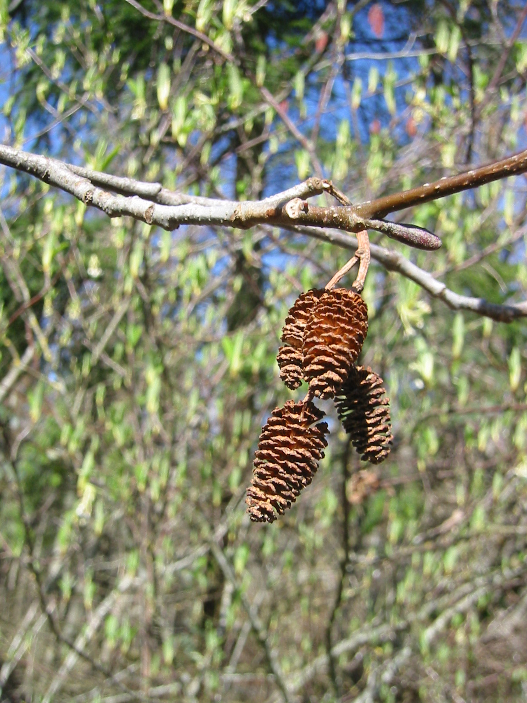

# Red Alder

*Photo: [Walter Siegmund](https://commons.wikimedia.org/wiki/File%3AAlnus%20rubra%200020.JPG) | CC BY 2.5*

## Basic information
- **Scientific name:** Alnus rubra
- **Plant type:** Deciduous tree (nitrogen-fixing pioneer)
- **USDA zones:** 
- **Native region:** Western North America, Alaska to California, east to Idaho and Montana

## Growth characteristics
- **Mature height:** 70–100 feet
- **Mature spread:** ~35–50 feet
- **Growth rate:** Rapid
- **Lifespan:** Relatively short-lived (pioneer species)
- **Roots:** Nitrogen-fixing (actinorhizal); thrives on mineral soils

## Growing conditions
- **Sun requirements:** Full Sun/Part Shade
- **Water needs:** Medium-High (moist soils; tolerates wet, riparian sites)
- **Soil type:** Wide range, from gravels and sands to clay; nitrogen-fixing improves poor mineral soils
- **Soil pH:** ~5.0–7.5
- **Native habitat:** Streambanks, floodplains, moist disturbed ground

## Seasonal interest
- **Bloom time:** 
- **Bloom color:** 
- **Fall color:** Yellow
- **Winter interest:** 

## Wildlife value
- **Attracts:** 
- **Host plant for:** 
- **Provides:** 

## Planting details
- **Quantity needed:** 
- **Location/bed:** 
- **Spacing:** 
- **Companion plants:** 

## Sourcing
- **Purchase source:** 
- **Cost per plant:** 
- **Date purchased:** 
- **Date planted:** 

## Care & maintenance
- **Pruning needs:** 
- **Fertilizer:** 
- **Mulch:** 
- **Special care:** 

## Notes
- **Design notes:** 
- **Observations:** 
- **Challenges:** 

## Sources
- Fourth Corner Nurseries Wholesale Catalog (Fall 2025/Spring 2026): http://fourthcornernurseries.com
- NC State Extension Gardener Plant Toolbox: https://plants.ces.ncsu.edu/plants/alnus-rubra/
- Oregon State University Wood Innovation Center: https://owic.oregonstate.edu/red-alder-alnus-rubra
