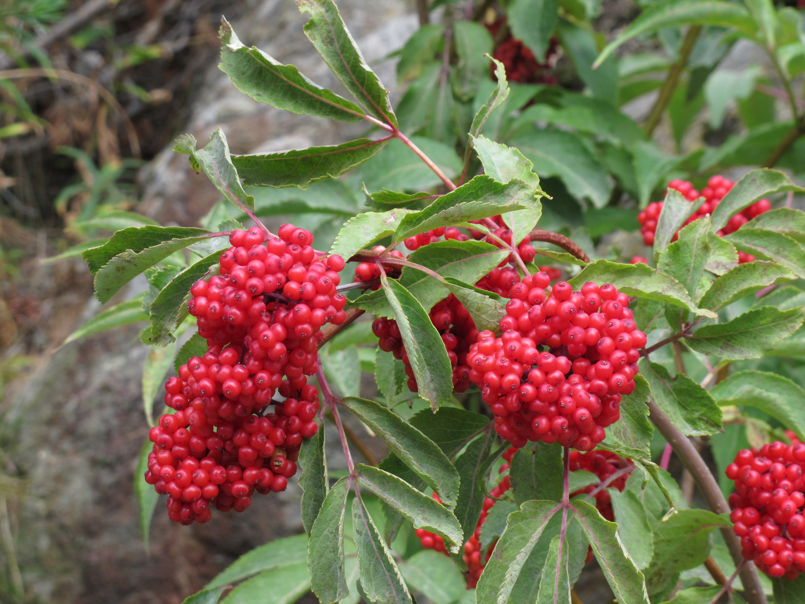

# Red Elderberry

*Photo: [Robert Flogaus-Faust](https://commons.wikimedia.org/wiki/File:Sambucus_racemosa_RF.jpg) | CC BY 4.0*

## Basic information
- **Scientific name:** Sambucus racemosa
- **Plant type:** Deciduous Shrub
- **USDA zones:** 3-7
- **Native region:** Pacific Northwest; throughout North America in moist forest habitats

## Growth characteristics
- **Mature height:** 8-15 feet
- **Mature spread:** 8-12 feet
- **Growth rate:** Fast
- **Lifespan:** Long-lived shrub (20+ years)
- **Roots:**

## Growing conditions
- **Sun requirements:** Part Shade/Full Shade
- **Water needs:** Medium-High (prefers moist conditions)
- **Soil type:** Rich, moist, well-drained
- **Soil pH:** 5.5-7.0
- **Native habitat:** Moist forests, streambanks, forest edges, disturbed areas

## Seasonal interest
- **Bloom time:** April-June
- **Bloom color:** Creamy white, pyramidal clusters
- **Fall color:** Yellow
- **Winter interest:** Attractive branching structure

## Wildlife value
- **Attracts:** Birds, butterflies, native bees
- **Host plant for:** Various moth species
- **Provides:** Berries for birds (over 50 species eat them); early nectar source; cover and nesting

## Planting details
- **Quantity needed:**
- **Location/bed:**
- **Spacing:** 8-10 feet apart
- **Companion plants:** Sword fern, salmonberry, red flowering currant, vine maple

## Sourcing
- **Purchase source:**
- **Cost per plant:**
- **Date purchased:**
- **Date planted:**

## Care & maintenance
- **Pruning needs:** Can prune to shape; tolerates hard pruning; remove dead wood
- **Fertilizer:** Generally not needed
- **Mulch:** 2-3 inches organic mulch
- **Special care:** Very low maintenance; tolerates wet soils

## Notes
- **Design notes:** Excellent for naturalistic plantings, rain gardens, and wildlife habitat; showy flower clusters followed by bright red berries
- **Observations:**
- **Challenges:** Berries are toxic to humans when raw (can be cooked); spreads by suckers

## Sources
- King County Native Plant Guide: https://green2.kingcounty.gov/gonative/Plant.aspx?Act=view&PlantID=32
- USDA Plants Database: https://plants.usda.gov/home/plantProfile?symbol=SARA2
- Lady Bird Johnson Wildflower Center: https://www.wildflower.org/plants/result.php?id_plant=sara2
