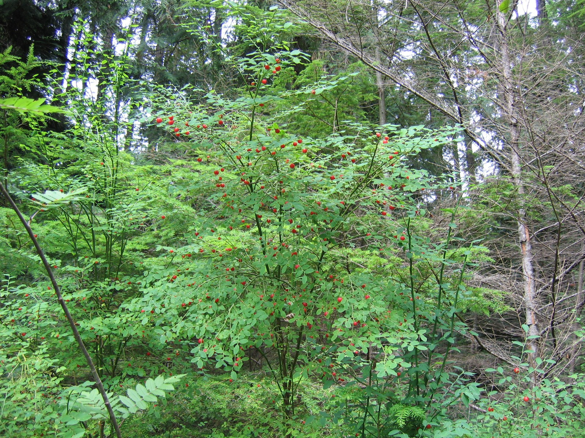

# Red Huckleberry

*Photo: [Meggar](https://commons.wikimedia.org/wiki/File:Vaccinium_parvifolium.jpg) | CC BY-SA 3.0*

## Basic information
- **Scientific name:** Vaccinium parvifolium
- **Plant type:** Shrub
- **USDA zones:** 6-9
- **Native region:** Pacific Northwest, from Alaska to California

## Growth characteristics
- **Mature height:** 4-12 ft
- **Mature spread:** 3-6 ft
- **Growth rate:** Slow to Medium
- **Lifespan:** Long-lived (50+ years)
- **Roots:** Shallow, fibrous

## Growing conditions
- **Sun requirements:** Part Shade/Full Shade
- **Water needs:** Medium
- **Soil type:** Acidic, humus-rich, well-drained
- **Soil pH:** 4.5-6.0
- **Native habitat:** Coniferous forests, often on rotting wood or stumps

## Seasonal interest
- **Bloom time:** April-June
- **Bloom color:** Greenish-pink
- **Fall color:** Red (leaves)
- **Winter interest:** Bright green stems

## Wildlife value
- **Attracts:** Birds, small mammals
- **Host plant for:**
- **Provides:** Berries (food for birds and wildlife)

## Planting details
- **Quantity needed:**
- **Location/bed:**
- **Spacing:** 3-5 ft
- **Companion plants:** Sword fern, salal, Oregon grape

## Sourcing
- **Purchase source:**
- **Cost per plant:**
- **Date purchased:**
- **Date planted:**

## Care & maintenance
- **Pruning needs:** Minimal; remove dead wood
- **Fertilizer:** Generally not needed; acidic mulch beneficial
- **Mulch:** Leaf mold or conifer needles
- **Special care:** Prefers to grow on decaying wood

## Notes
- **Design notes:**
- **Observations:**
- **Challenges:**
