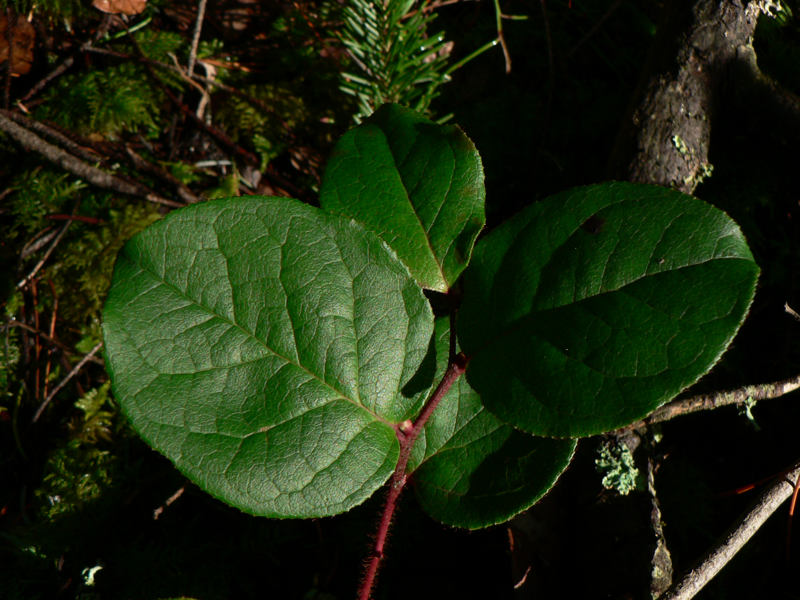

# Salal

*Photo: [Walter Siegmund](https://commons.wikimedia.org/wiki/File:Gaultheria_shallon_31974.JPG) | CC BY 2.5*

## Basic information
- **Scientific name:** Gaultheria shallon
- **Plant type:** Shrub
- **USDA zones:** 6-9
- **Native region:** Pacific Coast, from Alaska to California

## Growth characteristics
- **Mature height:** 2-6 ft (up to 10 ft in ideal conditions)
- **Mature spread:** 3-6 ft (spreads by rhizomes)
- **Growth rate:** Slow to Medium
- **Lifespan:** Long-lived
- **Roots:** Spreading rhizomes

## Growing conditions
- **Sun requirements:** Part Shade/Full Shade (tolerates sun with moisture)
- **Water needs:** Low to Medium (drought tolerant once established)
- **Soil type:** Acidic, well-drained; tolerates poor soils
- **Soil pH:** 4.5-6.0
- **Native habitat:** Coniferous forests, coastal bluffs

## Seasonal interest
- **Bloom time:** May-July
- **Bloom color:** Pink to white
- **Fall color:** Evergreen
- **Winter interest:** Evergreen foliage, dark berries

## Wildlife value
- **Attracts:** Bees, hummingbirds, birds
- **Host plant for:** Brown elfin butterfly
- **Provides:** Nectar, berries, shelter

## Planting details
- **Quantity needed:**
- **Location/bed:**
- **Spacing:** 3-5 ft
- **Companion plants:** Sword fern, evergreen huckleberry, Oregon grape

## Sourcing
- **Purchase source:** Woodbrook Native Plant Nursery (Gig Harbor) - https://woodbrooknativeplantnursery.com
- **Cost per plant:** $18.00 (1-gal), $8.98 (quart), $6.75 (3.5")
- **Date purchased:**
- **Date planted:**

## Care & maintenance
- **Pruning needs:** Prune to control spread; can be cut back hard
- **Fertilizer:** Generally not needed
- **Mulch:** Acidic mulch beneficial
- **Special care:** Can be aggressive; plan for spread

## Notes
- **Design notes:**
- **Observations:**
- **Challenges:**
