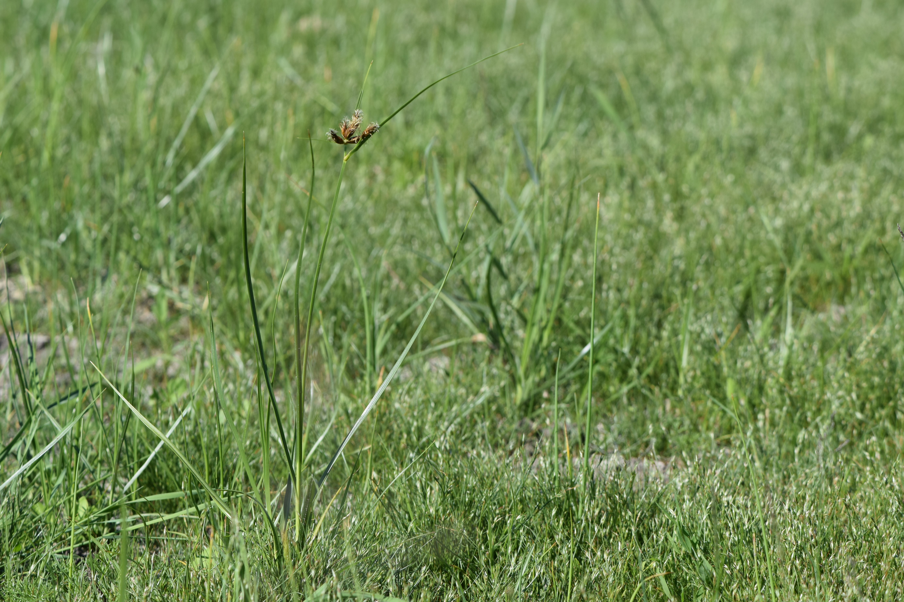

# Saltmarsh Bulrush

*Photo: [Author Name](wikimedia-source-url) | License*

## Basic information
- **Scientific name:** Bolboschoenus maritimus
- **Plant type:** Emergent perennial bulrush/sedge (Cyperaceae)
- **USDA zones:** 
- **Native region:** Across the United States (except the Southeast); PNW (Puget lowland) fresh and brackish marshes

## Growth characteristics
- **Mature height:** 1–5 feet (strong triangular culms)
- **Mature spread:** Rhizomatous; spreads to form colonies
- **Growth rate:** Fast (vigorous rhizomatous/tuberous spreader)
- **Lifespan:** 
- **Roots:** Rhizomes with tubers

## Growing conditions
- **Sun requirements:** Full Sun
- **Water needs:** High (wetland — moist soil to ~1 ft standing water; tolerates inundation)
- **Soil type:** Wet, saline or alkaline soils; clays to silt loams to sands; high salinity tolerance (halophyte)
- **Soil pH:** Tolerates alkaline soils up to ~9
- **Native habitat:** Fresh and brackish marshes, estuaries, wet meadows

## Seasonal interest
- **Bloom time:** 
- **Bloom color:** 
- **Fall color:** 
- **Winter interest:** 

## Wildlife value
- **Attracts:** 
- **Host plant for:** 
- **Provides:** 

## Planting details
- **Quantity needed:** 
- **Location/bed:** 
- **Spacing:** 
- **Companion plants:** 

## Sourcing
- **Purchase source:** 
- **Cost per plant:** 
- **Date purchased:** 
- **Date planted:** 

## Care & maintenance
- **Pruning needs:** 
- **Fertilizer:** 
- **Mulch:** 
- **Special care:** 

## Notes
- **Design notes:** 
- **Observations:** 
- **Challenges:** 

## Sources
- Fourth Corner Nurseries Wholesale Catalog (Fall 2025/Spring 2026): http://fourthcornernurseries.com
- Lady Bird Johnson Wildflower Center: https://www.wildflower.org/plants/result.php?id_plant=BOMA7
- Calscape (California Native Plant Society): https://calscape.org/Bolboschoenus-maritimus-(Alkali-Bulrush)
