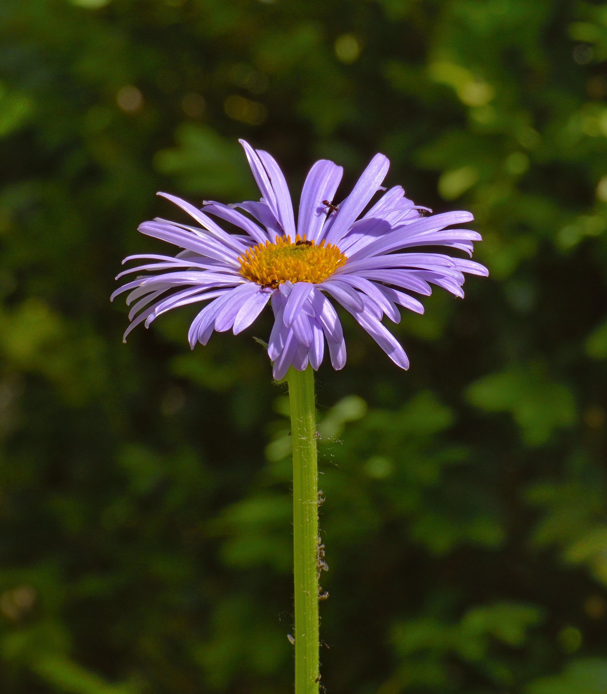

# Seaside Daisy

*Photo: [Ввласенко](https://commons.wikimedia.org/wiki/File:Erigeron_glaucus.jpg) | CC BY 4.0*

## Basic information
- **Scientific name:** Erigeron glaucus
- **Plant type:** Perennial
- **USDA zones:** 5-9
- **Native region:** Pacific Coast, from Oregon to California

## Growth characteristics
- **Mature height:** 6-12 inches
- **Mature spread:** 12-18 inches
- **Growth rate:** Medium
- **Lifespan:** Short to medium-lived perennial (may decline after 3-5 years)

## Growing conditions
- **Sun requirements:** Full Sun/Part Sun
- **Water needs:** Low-Medium (drought tolerant once established)
- **Soil type:** Well-drained, sandy; tolerates poor soils
- **Soil pH:** 6.0-8.0

## Seasonal interest
- **Bloom time:** April-August (long bloom season)
- **Bloom color:** Lavender-blue to pale purple with yellow centers
- **Fall color:** Evergreen to semi-evergreen
- **Winter interest:** Basal rosette of blue-green foliage persists

## Wildlife value
- **Attracts:** Bees, butterflies, beneficial insects
- **Host plant for:** N/A
- **Provides:** Nectar, pollen

## Planting details
- **Quantity needed:**
- **Location/bed:**
- **Spacing:** 12-15 inches apart
- **Companion plants:** Yarrow, Douglas iris, buckwheat, native grasses

## Sourcing
- **Purchase source:**
- **Cost per plant:**
- **Date purchased:**
- **Date planted:**

## Care & maintenance
- **Pruning needs:** Deadhead spent blooms to encourage continued flowering; cut back leggy growth
- **Fertilizer:** None needed
- **Mulch:** Gravel or light organic mulch; avoid heavy mulch near crown
- **Special care:** Excellent drainage essential; tolerates salt spray and coastal conditions

## Notes
- **Design notes:** Cheerful, long-blooming daisy; blue-green foliage; excellent for rock gardens, borders, coastal gardens
- **Observations:**
- **Challenges:** Can rot in heavy, wet soils; may be short-lived but often self-seeds

## Sources
- Missouri Botanical Garden: https://www.missouribotanicalgarden.org/PlantFinder/PlantFinderDetails.aspx?taxonid=277792
- USDA Plants Database: https://plants.usda.gov/home/plantProfile?symbol=ERGL2
- Lady Bird Johnson Wildflower Center: https://www.wildflower.org/plants/result.php?id_plant=ergl2
- Calflora: https://www.calflora.org/app/taxon?crn=2998
