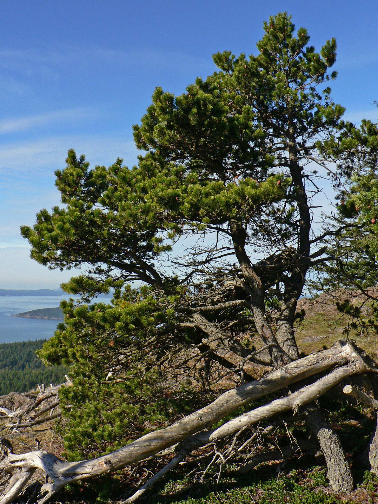

# Shore Pine

*Photo: [Walter Siegmund](https://commons.wikimedia.org/wiki/File%3APinus%20contorta%2028263.JPG) | CC BY 2.5*

## Basic information
- **Scientific name:** Pinus contorta var. contorta
- **Plant type:** Evergreen conifer (two-needled pine)
- **USDA zones:** 
- **Native region:** Pacific coast, Alaska to northern California (coastal counterpart to lodgepole pine)

## Growth characteristics
- **Mature height:** 20–40 feet (rounded stature)
- **Mature spread:** ~15–25 feet (rounded crown)
- **Growth rate:** Fast
- **Lifespan:** Long-lived (100+ years)
- **Roots:** 

## Growing conditions
- **Sun requirements:** Full Sun
- **Water needs:** Low-Medium (highly adaptable — moist/boggy to well-drained or dry, nutrient-poor sites)
- **Soil type:** Adaptable to many soils — peat bogs, sandy, gravelly, and nutrient-poor; salt-spray tolerant
- **Soil pH:** 
- **Native habitat:** Coastal shores, lake and bog margins

## Seasonal interest
- **Bloom time:** 
- **Bloom color:** 
- **Fall color:** 
- **Winter interest:** 

## Wildlife value
- **Attracts:** 
- **Host plant for:** 
- **Provides:** 

## Planting details
- **Quantity needed:** 
- **Location/bed:** 
- **Spacing:** 
- **Companion plants:** 

## Sourcing
- **Purchase source:** 
- **Cost per plant:** 
- **Date purchased:** 
- **Date planted:** 

## Care & maintenance
- **Pruning needs:** 
- **Fertilizer:** 
- **Mulch:** 
- **Special care:** 

## Notes
- **Design notes:** 
- **Observations:** 
- **Challenges:** 

## Sources
- Fourth Corner Nurseries Wholesale Catalog (Fall 2025/Spring 2026): http://fourthcornernurseries.com
- Oregon State University Landscape Plants: https://landscapeplants.oregonstate.edu/plants/pinus-contorta-var-contorta
- NC State Extension Gardener Plant Toolbox: https://plants.ces.ncsu.edu/plants/pinus-contorta/
