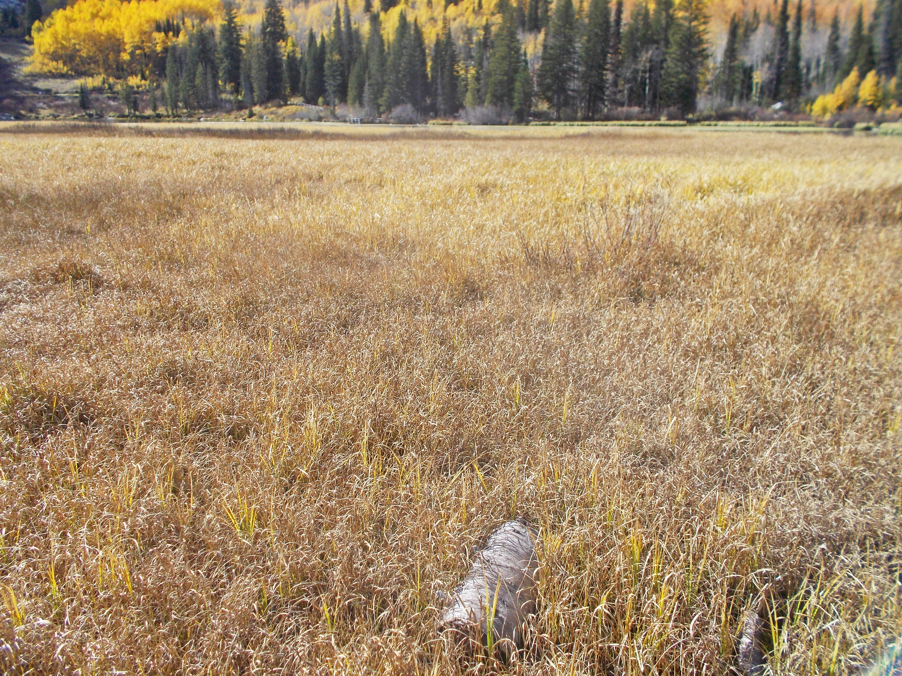

# Sitka Sedge

*Photo: [Andrey Zharkikh](https://commons.wikimedia.org/wiki/File%3ACarex%20aquatilis%20plant%20%2814%29.jpg) | CC BY 2.0*

## Basic information
- **Scientific name:** Carex sitchensis (syn. Carex aquatilis var. dives)
- **Plant type:** Perennial sedge (Cyperaceae)
- **USDA zones:** 
- **Native region:** West Coast of North America, Alaska to northwestern California

## Growth characteristics
- **Mature height:** 1–4 feet
- **Mature spread:** Tufted on short rhizomes; forms clumps/colonies
- **Growth rate:** 
- **Lifespan:** 
- **Roots:** Short rhizomes

## Growing conditions
- **Sun requirements:** Full Sun/Part Shade
- **Water needs:** High (wet — saturated soils, shallow water)
- **Soil type:** Adaptable; tolerates sandy, loamy, and clay soils; prefers consistently wet ground
- **Soil pH:** 
- **Native habitat:** Wet meadows, marshes, lake shores, pond margins

## Seasonal interest
- **Bloom time:** 
- **Bloom color:** 
- **Fall color:** 
- **Winter interest:** 

## Wildlife value
- **Attracts:** 
- **Host plant for:** 
- **Provides:** 

## Planting details
- **Quantity needed:** 
- **Location/bed:** 
- **Spacing:** 
- **Companion plants:** 

## Sourcing
- **Purchase source:** 
- **Cost per plant:** 
- **Date purchased:** 
- **Date planted:** 

## Care & maintenance
- **Pruning needs:** 
- **Fertilizer:** 
- **Mulch:** 
- **Special care:** 

## Notes
- **Design notes:** 
- **Observations:** 
- **Challenges:** 

## Sources
- Fourth Corner Nurseries Wholesale Catalog (Fall 2025/Spring 2026): http://fourthcornernurseries.com
- Lady Bird Johnson Wildflower Center (Carex aquatilis var. dives): https://www.wildflower.org/plants/result.php?id_plant=CAAQD
- U.S. Fish & Wildlife Service: https://www.fws.gov/species/sitka-sedge-carex-aquatilis-var-dives
