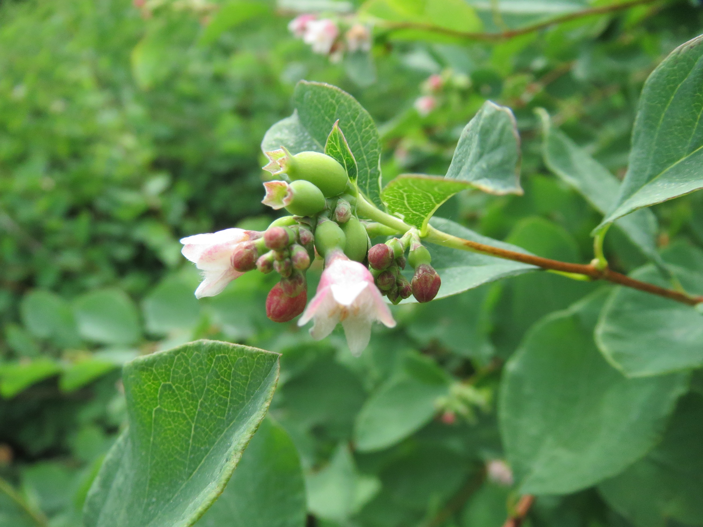

# Common Snowberry

*Photo: [H. Zell](https://commons.wikimedia.org/wiki/File:Symphoricarpos_albus_001.JPG) | CC BY-SA 3.0*

## Basic information
- **Scientific name:** Symphoricarpos albus
- **Plant type:** Deciduous Shrub
- **USDA zones:** 3-7
- **Native region:** Pacific Northwest; southeast Alaska to California, across northern US and Canada

## Growth characteristics
- **Mature height:** 3-6 feet
- **Mature spread:** 3-6 feet (spreads by root suckers)
- **Growth rate:** Medium-Fast
- **Lifespan:** Long-lived shrub
- **Roots:** Shallow fibrous roots, spreads via runners

## Growing conditions
- **Sun requirements:** Full Sun/Part Shade/Full Shade
- **Water needs:** Low-Medium (very adaptable)
- **Soil type:** Highly adaptable; tolerates poor, wet, dry, and heavy clay soils
- **Soil pH:** 5.5-7.5
- **Native habitat:** Forest, shrub thicket, open slopes, rocky slopes

## Seasonal interest
- **Bloom time:** May-August
- **Bloom color:** Pink to white
- **Fall color:** Yellow
- **Winter interest:** Distinctive white berries persist through winter

## Wildlife value
- **Attracts:** Hummingbirds, native bees, birds, small mammals
- **Host plant for:** Snowberry clearwing moth, hummingbird clearwing moth, Vashti sphinx moth (20+ Lepidoptera species)
- **Provides:** Berries for birds and mammals; cover and nesting sites; nectar for pollinators

## Planting details
- **Quantity needed:**
- **Location/bed:**
- **Spacing:** 4-6 feet apart
- **Companion plants:** Oregon grape, roses, other native shrubs

## Sourcing
- **Purchase source:**
- **Cost per plant:**
- **Date purchased:**
- **Date planted:**

## Care & maintenance
- **Pruning needs:** Can prune to shape; tolerates hard pruning
- **Fertilizer:** None needed
- **Mulch:** Optional
- **Special care:** Spreads by root suckers to form thickets; best given space; extremely versatile and resilient

## Notes
- **Design notes:** Excellent for erosion control, rain gardens, wildlife habitat; white berries provide striking winter interest; tolerates difficult conditions including dry shade
- **Observations:**
- **Challenges:** Berries are poisonous to humans; spreads vigorously by suckers

## Sources
- Native Plants PNW: https://nativeplantspnw.com/common-snowberry-symphoricarpos-albus/
- Sparrowhawk Native Plants: https://sparrowhawknativeplants.com/products/snowberry
- Lady Bird Johnson Wildflower Center: https://www.wildflower.org/plants/result.php?id_plant=syal
