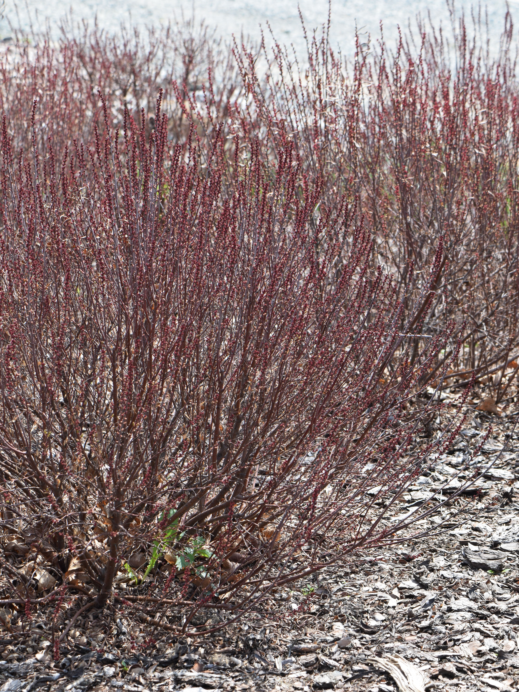

# Sweetgale

*Photo: [Author Name](wikimedia-source-url) | License*

## Basic information
- **Scientific name:** Myrica gale
- **Plant type:** Deciduous shrub
- **USDA zones:** 
- **Native region:** Northern North America (and northern Europe); margins of bogs, estuaries, and lakes

## Growth characteristics
- **Mature height:** 3–7 feet
- **Mature spread:** ~3–5 feet (coppices/suckers after disturbance)
- **Growth rate:** 
- **Lifespan:** 
- **Roots:** Nitrogen-fixing (actinorhizal)

## Growing conditions
- **Sun requirements:** Full Sun/Part Shade
- **Water needs:** Medium-High (moist to wet; avoid stagnant waterlogging)
- **Soil type:** Sandy, loamy, or peaty soils; acidic; salt-spray tolerant in shoreline plantings
- **Soil pH:** Acidic, ~3.5–6.5 (occasionally to ~7.5 in fens)
- **Native habitat:** Bog, estuary, and lake margins

## Seasonal interest
- **Bloom time:** 
- **Bloom color:** 
- **Fall color:** 
- **Winter interest:** 

## Wildlife value
- **Attracts:** 
- **Host plant for:** 
- **Provides:** 

## Planting details
- **Quantity needed:** 
- **Location/bed:** 
- **Spacing:** 
- **Companion plants:** 

## Sourcing
- **Purchase source:** 
- **Cost per plant:** 
- **Date purchased:** 
- **Date planted:** 

## Care & maintenance
- **Pruning needs:** 
- **Fertilizer:** 
- **Mulch:** 
- **Special care:** 

## Notes
- **Design notes:** 
- **Observations:** 
- **Challenges:** 

## Sources
- Fourth Corner Nurseries Wholesale Catalog (Fall 2025/Spring 2026): http://fourthcornernurseries.com
- Lady Bird Johnson Wildflower Center: https://www.wildflower.org/plants/result.php?id_plant=myga
- Plants For A Future (PFAF): https://pfaf.org/user/plant.aspx?LatinName=Myrica+gale
