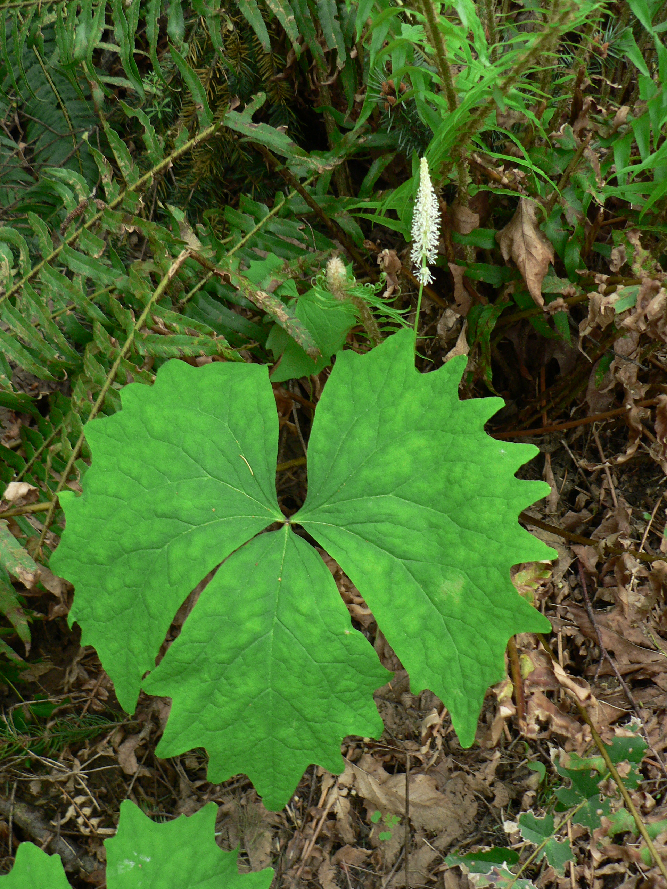

# Vanilla Leaf

*Photo: [Walter Siegmund](https://commons.wikimedia.org/wiki/File:Achlys_triphylla_10660.JPG) | CC BY 2.5*

## Basic information
- **Scientific name:** Achlys triphylla
- **Plant type:** Herbaceous Perennial / Groundcover
- **USDA zones:** 6-9
- **Native region:** Pacific Northwest; Cascades and Coast Ranges from British Columbia to northern California

## Growth characteristics
- **Mature height:** 12-20 inches
- **Mature spread:** Spreads by rhizomes to form colonies
- **Growth rate:** Medium
- **Lifespan:** Long-lived perennial
- **Roots:** Rhizomatous

## Growing conditions
- **Sun requirements:** Part Shade/Full Shade
- **Water needs:** Medium (drought tolerant once established)
- **Soil type:** Rich, well-drained, high organic matter; tolerates average soils
- **Soil pH:** Acidic to neutral
- **Native habitat:** Moist shady conifer and mixed forests, up to 5,000' elevation

## Seasonal interest
- **Bloom time:** April-June
- **Bloom color:** Creamy white (pipe-cleaner shaped spikes)
- **Fall color:** Deciduous; dies back
- **Winter interest:** Dormant

## Wildlife value
- **Attracts:** Butterflies, bees, hummingbirds
- **Host plant for:** Various native insects
- **Provides:** Nectar; groundcover habitat

## Planting details
- **Quantity needed:**
- **Location/bed:**
- **Spacing:** 12-18 inches apart
- **Companion plants:** Western bleeding heart, wild ginger, thimbleberry, salmonberry, false Solomon's seal

## Sourcing
- **Purchase source:**
- **Cost per plant:**
- **Date purchased:**
- **Date planted:**

## Care & maintenance
- **Pruning needs:** None; remove dead foliage in late winter if desired
- **Fertilizer:** None needed in rich soil
- **Mulch:** Leaf mulch beneficial
- **Special care:** Low maintenance once established; deer and rabbit resistant

## Notes
- **Design notes:** Excellent shade groundcover; distinctive three-part leaves; dried leaves have pleasant vanilla scent (hence common name "sweet after death")
- **Observations:**
- **Challenges:** Needs consistent shade; may go dormant in dry summers

## Sources
- University of Washington: https://depts.washington.edu/propplnt/Plants/ACTR.htm
- Lady Bird Johnson Wildflower Center: https://www.wildflower.org/plants/result.php?id_plant=actr
- Native Plant Salvage Foundation: https://www.nativeplantsalvage.org/native-plant-database/p/ach-tri
