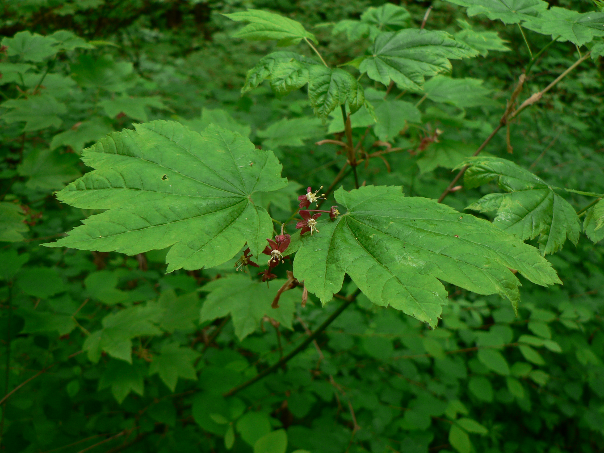

# Vine Maple

*Photo: [Walter Siegmund](https://commons.wikimedia.org/wiki/File:Acer_circinatum_10751.JPG) | CC BY 2.5*

## Basic information
- **Scientific name:** Acer circinatum
- **Plant type:** Deciduous Tree/Large Shrub
- **USDA zones:** 5-9
- **Native region:** Pacific Northwest, from British Columbia to California

## Growth characteristics
- **Mature height:** 15-25 feet
- **Mature spread:** 15-25 feet
- **Growth rate:** Medium
- **Lifespan:** Long-lived (50+ years)

## Growing conditions
- **Sun requirements:** Part Shade/Full Shade (tolerates sun with adequate moisture)
- **Water needs:** Low-Medium (dry to moist)
- **Soil type:** Adaptable; prefers rich, well-drained
- **Soil pH:** 5.5-7.0

## Seasonal interest
- **Bloom time:** April-May
- **Bloom color:** Reddish-purple and white
- **Fall color:** Outstanding - yellow, orange, red
- **Winter interest:** Attractive multi-stemmed form and branch structure

## Wildlife value
- **Attracts:** Native bees, birds
- **Host plant for:** Various moth species
- **Provides:** Seeds for birds and small mammals; cover

## Planting details
- **Quantity needed:**
- **Location/bed:**
- **Spacing:** 15-20 feet apart
- **Companion plants:** Sword fern, wild ginger, bleeding heart, trillium, salal

## Sourcing
- **Purchase source:**
- **Cost per plant:**
- **Date purchased:**
- **Date planted:**

## Care & maintenance
- **Pruning needs:** Minimal; prune to shape if desired; can limb up for tree form
- **Fertilizer:** Generally not needed in good soil
- **Mulch:** 2-3 inches of organic mulch
- **Special care:** Excellent for erosion control on slopes and stream banks

## Notes
- **Design notes:** One of the most desirable native plants; famous for spectacular fall color; lower branches wind sinuously creating vine-like appearance; works as multi-stemmed shrub or small tree
- **Observations:**
- **Challenges:** May need protection from hot afternoon sun in exposed locations

## Sources
- King County Native Plant Guide: https://green2.kingcounty.gov/gonative/Plant.aspx?Act=view&PlantID=47
- Missouri Botanical Garden: https://www.missouribotanicalgarden.org/PlantFinder/PlantFinderDetails.aspx?taxonid=275254
- USDA Plants Database: https://plants.usda.gov/home/plantProfile?symbol=ACCI
- Oregon State University Landscape Plants: https://landscapeplants.oregonstate.edu/plants/acer-circinatum
