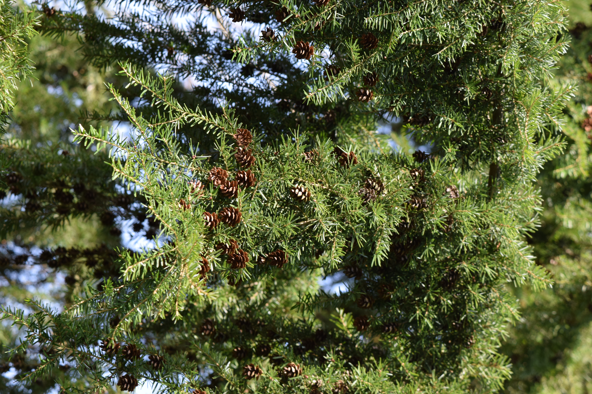

# Western Hemlock

*Photo: [Author Name](wikimedia-source-url) | License*

## Basic information
- **Scientific name:** Tsuga heterophylla
- **Plant type:** Evergreen conifer
- **USDA zones:** 
- **Native region:** Western North American forests (Pacific Northwest)

## Growth characteristics
- **Mature height:** To ~200 feet (typically 90–150 ft in cultivation)
- **Mature spread:** ~20–40 feet
- **Growth rate:** 
- **Lifespan:** Long-lived
- **Roots:** Shallow

## Growing conditions
- **Sun requirements:** Full Sun to Full Shade (very shade tolerant)
- **Water needs:** Medium-High (moist, well-drained soils; drought intolerant; avoid standing water)
- **Soil type:** Rich, acidic, well-drained loam; consistently moist
- **Soil pH:** ~4.0–6.5 (acidic)
- **Native habitat:** Moist coniferous forests

## Seasonal interest
- **Bloom time:** 
- **Bloom color:** 
- **Fall color:** 
- **Winter interest:** 

## Wildlife value
- **Attracts:** 
- **Host plant for:** 
- **Provides:** 

## Planting details
- **Quantity needed:** 
- **Location/bed:** 
- **Spacing:** 
- **Companion plants:** 

## Sourcing
- **Purchase source:** 
- **Cost per plant:** 
- **Date purchased:** 
- **Date planted:** 

## Care & maintenance
- **Pruning needs:** 
- **Fertilizer:** 
- **Mulch:** 
- **Special care:** 

## Notes
- **Design notes:** 
- **Observations:** 
- **Challenges:** 

## Sources
- Fourth Corner Nurseries Wholesale Catalog (Fall 2025/Spring 2026): http://fourthcornernurseries.com
- NC State Extension Gardener Plant Toolbox: https://plants.ces.ncsu.edu/plants/tsuga-heterophylla/
- Oregon State University Landscape Plants: https://landscapeplants.oregonstate.edu/plants/tsuga-heterophylla
