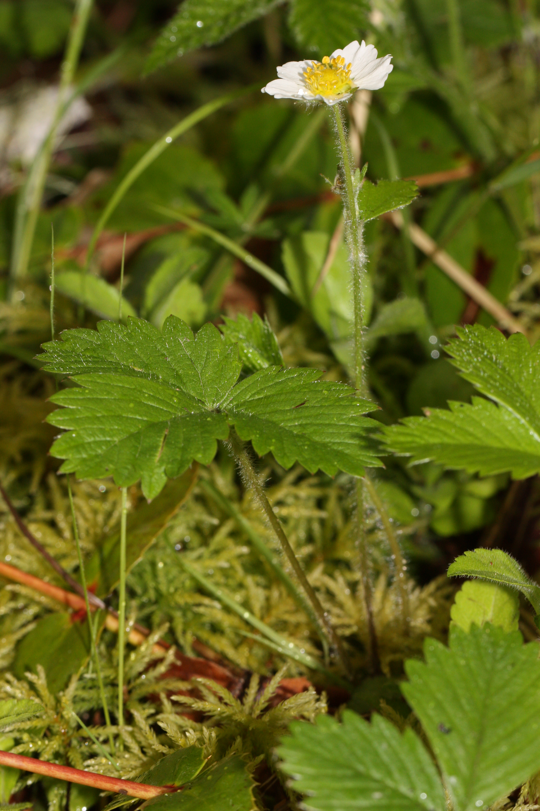

# Woodland Strawberry

*Photo: [Walter Siegmund](https://commons.wikimedia.org/wiki/File%3AFragaria%20vesca%205048.JPG) | CC BY-SA 3.0*

## Basic information
- **Scientific name:** Fragaria vesca
- **Plant type:** Perennial groundcover (Rosaceae)
- **USDA zones:** 
- **Native region:** Throughout much of North America (except the South); Pacific Northwest native

## Growth characteristics
- **Mature height:** 3–9 inches
- **Mature spread:** 9–12 inches; spreads by rhizomes and above-ground stolons (runners)
- **Growth rate:** 
- **Lifespan:** 
- **Roots:** Rhizomes and stolons (runners)

## Growing conditions
- **Sun requirements:** Full Sun to Part Shade (tolerates full shade in moist sites)
- **Water needs:** Low-Medium (regular to low; drought tolerant once established, with less fruit in dry shade)
- **Soil type:** Fertile, moist, well-drained; tolerates clay and ordinary garden soil
- **Soil pH:** ~5.4–6.8
- **Native habitat:** Woodland edges, clearings, streambanks

## Seasonal interest
- **Bloom time:** 
- **Bloom color:** 
- **Fall color:** 
- **Winter interest:** 

## Wildlife value
- **Attracts:** 
- **Host plant for:** 
- **Provides:** 

## Planting details
- **Quantity needed:** 
- **Location/bed:** 
- **Spacing:** 
- **Companion plants:** 

## Sourcing
- **Purchase source:** MSK Nursery
- **Cost per plant:** 
- **Date purchased:** 2026-07-05
- **Date planted:** 2026-07-05

## Care & maintenance
- **Pruning needs:** 
- **Fertilizer:** 
- **Mulch:** 
- **Special care:** 

## Notes
- **Design notes:** 
- **Observations:** 
- **Challenges:** 

## Sources
- Calscape (California Native Plant Society): https://calscape.org/Fragaria-vesca-(Woodland-Strawberry)
- King County Native Plant Guide: https://green2.kingcounty.gov/gonative/Plant.aspx?Act=view&PlantID=70
- Native Plant Trust (Go Botany): https://plantfinder.nativeplanttrust.org/plant/Fragaria-vesca
